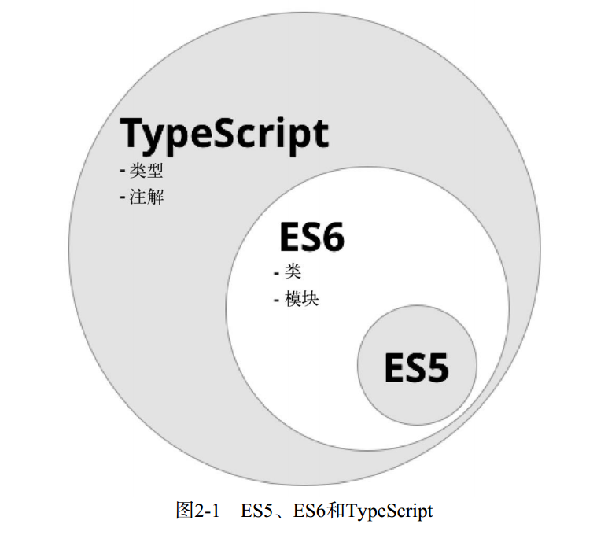

# 第二章 TypeScript

## Angular是用TypeScript构建的

TypeScript并不是一门全新的语言，而是ES6的超集。所有的ES6代码都是完全有效且可编译的TypeScript代码。图2-1展示了它们之间的关系。



## TypeScript 提供了哪些特性

TypeScript相对于ES5有五大改善：

- 类型
- 类
- 注解
- 模块导入
- 语言工具包（比如，解构）

## 类型

相对于ES6， TypeScript最大的改善是增加了类型系统。

类型检查的好处有：

- (1) 有助于代码的编写，因为它可以在编译期预防bug；
- (2) 有助于代码的阅读，因为它能清晰地表明你的意图.

另外值得一提的是， TypeScript中的类型是可选的。如果希望写一些快速代码或功原型，可以首先省略类型，然后再随着代码日趋成熟逐渐加上类型.

TypeScript的新语法是从ES5自然演化而来的，仍沿用var来定义变量，但现在可以时为变量名提供可选的变量类型了：`var name: string;`

在声明函数时，也可以为函数参数和返回值指定类型：

```ts
function greetText(name: string): string {
return "Hello " + name;
}
```

## 尝试 REPL

我们要先安装一个小工具， 名为TSUN（TypeScript Upgraded Node，支持TypeScript的升级版Node）：`npm install -g tsun`.接着启动它：

```
$ tsun
TSUN : TypeScript Upgraded Node
type in TypeScript expression to evaluate
type :help for commands in repl
>
```

这个小小的`>`是一个命令提示符，表示TSUN已经准备好接收命令了。

## 内置类型

### 字符串

```ts
var name: string = 'Felipe';
```

### 数字

无论整数还是浮点，任何类型的数字都属于number类型。在TypeScript中，所有的数字都是用浮点数表示的:

```ts
var age: number = 20;
```

### 布尔类型

```ts
var married: boolean = true;
```

### 数组

数组用`Array`类型表示。然而，因为数组是一组相同数据类型的集合，所以我们还需为数组中的条目指定一个类型。
我们可以用`Array<type>`或者`type[]`语法来为数组条目指定元素类型：

```ts
var jobs: Array<string> = ['IBM', 'Microsoft', 'Google'];
var jobs: string[] = ['Apple', 'Dell', 'HP'];
var jobs: Array<number> = [1, 2, 3];
var jobs: number[] = [4, 5, 6];
```

### 枚举

枚举是一组可命名数值的集合:

```ts
enum Role {Employee, Manager, Admin};
var role: Role = Role.Employee;
// 默认情况下，枚举类型的初始值是0。我们也可以调整初始化值的范围：
enum Role {Employee = 3, Manager, Admin};
var role: Role = Role.Employee;
// 在上面的代码中， Employee的初始值被设置为3而不是0。
// 枚举中其他项的值是依次递增的，意味着Manager的值为4， Admin的值为5。同样，我们也可以单独为枚举中的每一项指定值：
enum Role {Employee = 3, Manager = 5, Admin = 7};
var role: Role = Role.Employee;
// 还可以从枚举的值来反查它的名称：
enum Role {Employee, Manager, Admin};
console.log('Roles: ', Role[0], ',', Role[1], 'and', Role[2]);
```

### 任意类型

如果我们没有为变量指定类型，那它的默认类型就是`any`。在TypeScript中， any类型的变量能够接收任意类型的数据:

```ts
var something: any = 'as string';
something = 1;
something = [1, 2, 3];
```

### "无"类型

`void`意味着我们不期望那里有类型。它通常用作函数的返回值，表示没有任何返回值：

```ts
function setName(name: string): void {
this.name = name;
}
```

## 类

JavaScript ES5采用的是基于原型的面向对象设计。这种设计模型不使用类，而是依赖于原型.不过，在ES6中，我们终于有内置的类了。
用`class`关键字来定义一个类，紧随其后的是类名和类的代码块：

```ts
class Vehicle {
}
```

类可以包含属性、 方法以及构造函数。

### 属性

属性定义了类实例对象的数据。比如名叫Person的类可能有first_name、 last_name和age属性。

```ts
class Person {
    first_name: string;
    last_name: string;
    age: number;
}
```

### 方法

方法是运行在类对象实例上下文中的函数。在调用对象的方法之前，必须要有这个对象的实例。

```ts
class Person {
    first_name: string;
    last_name: string;
    age: number;

    greet() {
        console.log("Hello", this.first_name);
    }

    ageInYears(years: number): number {
        return this.age + years;
    }
}

// declare a variable of type Person
var p: Person;
// instantiate a new Person instance
p = new Person(); // 或者 var p:Person = new Person()
// give it a first_name
p.first_name = 'Felipe';
// call the greet method
p.greet();
```

### 构造函数

构造函数是当类进行实例化时执行的特殊函数。通常会在构造函数中对新对象进行初始化工作。

构造函数必须命名为`constructor`。因为构造函数是在类被实例化时调用的，所以它们可以有输入参数，但不能有任何返回值.

当类没有显式地定义构造函数时，将自动创建一个无参构造函数.

在TypeScript中，每个类只能有一个构造函数。这是违背ES6标准的。在ES6中，一个类可以拥有不同参数数量的多个构造函数重载实现.

```ts
class Person {
    first_name: string;
    last_name: string;
    age: number;

    constructor(first_name: string, last_name: string, age: number) {
        this.first_name = first_name;
        this.last_name = last_name;
        this.age = age;
    }
    greet() {
        console.log("Hello", this.first_name);
    }
    ageInYears(years: number): number {
        return this.age + years;
    }
}

var p: Person = new Person('Felipe', 'Coury', 36);
p.greet();
```

### 继承

面向对象的另一个重要特性就是继承。继承表明子类能够从父类得到它的行为。然后，我们就可以在这个子类中重写、修改以及添加行为。

TypeScript是完全支持继承特性的，并不像ES5那样要靠原型链实现。继承是TypeScript的核心语法，用`extends`关键字实现:

```ts
class Report {
    data: Array<string>;
    constructor(data: Array<string>) {
        this.data = data;
    }
    run() {
        this.data.forEach(function(line) { console.log(line); });
    }
}

class TabbedReport extends Report {
    headers: Array<string>;
    constructor(headers: string[], values: string[]) {
        super(values);
        this.headers = headers;
    }
    run() {
        console.log(this.headers);
        super.run();
    }
}

var headers: string[] = ['Name'];
var data: string[] = ['Alice Green', 'Paul Pfifer', 'Louis Blakenship'];
var r: TabbedReport = new TabbedReport(headers, data)
r.run();
```

## 工具

ES6和TypeScript提供了许多语法特性，让编码成为一种享受。其中最重要的两点是：

- 胖箭头函数语法
- 模板字符串

### 胖箭头函数

胖箭头（`=>`）函数是一种快速书写函数的简洁语法。在ES5中，每当我们要用函数作为方法参数时，都必须用function关键字和紧随其后的花括
号（{}）表示。就像这样：

```js
// ES5-like example
var data = ['Alice Green', 'Paul Pfifer', 'Louis Blakenship'];
data.forEach(function(line) { console.log(line); });
```

现在我们可以用`=>`语法来重写它了：

```ts
// Typescript example
var data: string[] = ['Alice Green', 'Paul Pfifer', 'Louis Blakenship'];
data.forEach( (line) => console.log(line) );
//当只有一个参数时，圆括号可以省略。箭头（=>）语法可以用作表达式：
var evens = [2,4,6,8];
var odds = evens.map(v => v + 1);

// 也可以用作语句：
data.forEach( line => {
console.log(line.toUpperCase())
});
```

=>语法还有一个重要的特性，就是它和环绕它的外部代码共享同一个`this`。这是它和普通function写法最重要的不同点.

```js
var nate = {
    name: "Nate",
    guitars: ["Gibson", "Martin", "Taylor"],
    printGuitars: function() {
        var self = this;
        this.guitars.forEach(function(g) {
        // this.name is undefined so we have to use self.name
            console.log(self.name + " plays a " + g);
        });
    }
};
```

```ts
var nate = {
    name: "Nate",
    guitars: ["Gibson", "Martin", "Taylor"],
    printGuitars: function() {
        this.guitars.forEach( (g) => {
            console.log(this.name + " plays a " + g);
        });
    }
};
```

可见，箭头函数是处理内联函数的好办法。这也让我们在JavaScript中更容易使用高阶函数。

### 模板字符串

ES6引入了新的模板字符串语法，它有两大优势：

(1) 可以在模板字符串中使用变量（不必被迫使用+来拼接字符串）；
(2) 支持多行字符串。

- 字符串中的变量

这种特性也叫字符串插值（string interpolation）。你可以在字符串中插入变量，做法如下：

```ts
var firstName = "Nate";
var lastName = "Murray";
// interpolate a string
var greeting = `Hello ${firstName} ${lastName}`;
console.log(greeting);
```

注意，字符串插值必须使用反引号，不能用单引号或双引号。

- 多行字符串

反引号字符串的另一个优点是允许多行文本：

```ts
var template = `
<div>
  <h1>Hello</h1>
  <p>This is a great website</p>
</div>
`
// do something with `template`
```

当我们要插入模板这样的长文本字符串时，多行字符串会非常有帮助.

## 总结

在TypeScript和ES6中还有很多其他的优秀语法特性，如：

- 接口
- 泛型
- 模块的导入、导出
- 标注
- 解构
