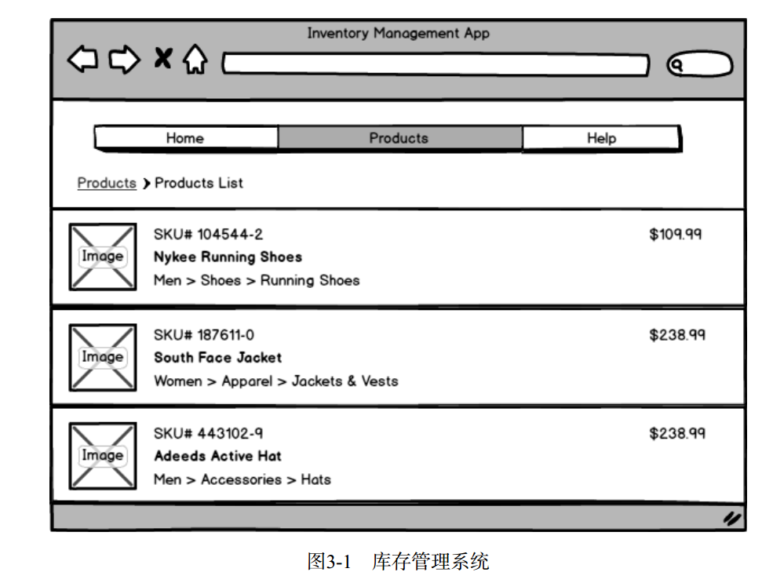
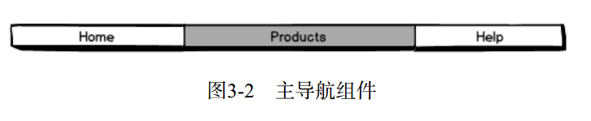
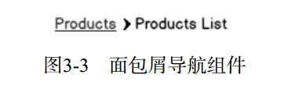
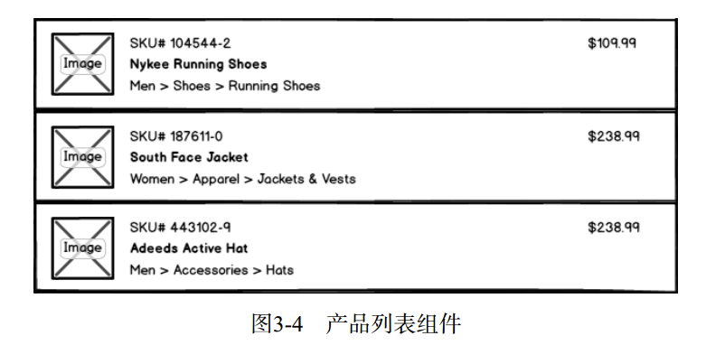
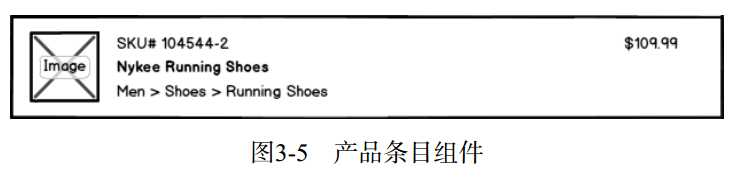
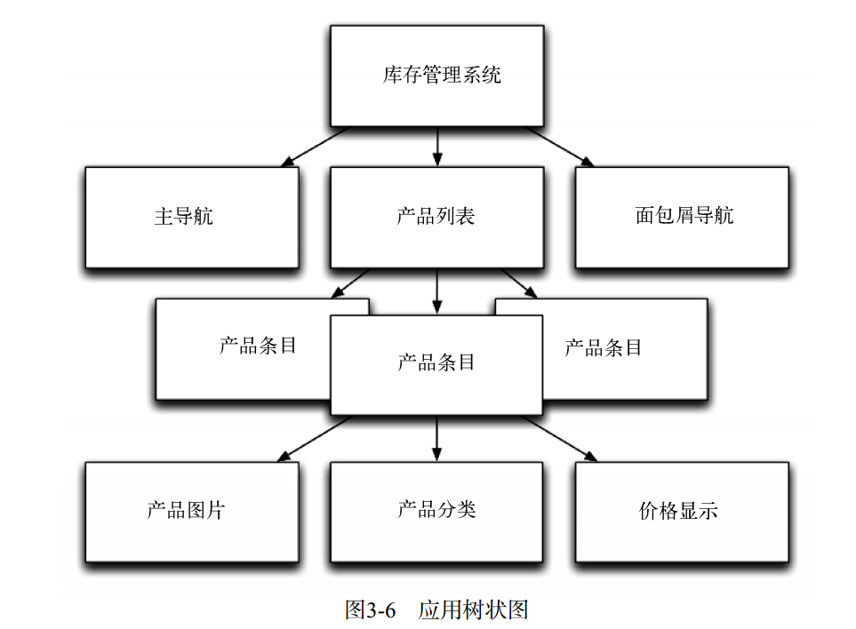

# Angular的工作原理

第一个重要概念： Angular应用是由`组件`构成的。可以将组件理解为一种教浏览器认识新HTML标签的方式。如果你有使用AngularJS的经验，那么可以把组件理解为类似于指令的概念。（事实上， Angular中也有指令，我们会在后面讨论具体的差异。）

## 应用

一个Angular应用其实就是一棵由组件构成的树。在这棵树的根结点，最顶层的组件就是应用本身。它会在浏览器启动（也叫引导）应用的时候被渲染。



- 主导航组件



- 面包屑导航组件



- 产品列表组件



- 产品条目组件



- 应用树状图



## 产品数据模型

Angular十分灵活，可以支持多种不同的数据模型（和数据架构）。不过这也意味着你需要决定自己的实现方式。在本章中，我们仅使用普通的JavaScript对象作为数据模型:

```ts
/**
* Provides a `Product` object
*/
class Product {
  constructor(
    public sku: string,
    public name: string,
    public imageUrl: string,
    public department: string[],
    public price: number) {
  }
}
```

## 组件

每个组件都由三个部分组成：

- 组件注解
- 视图
- 控制器

```ts
/**
 * @InventoryApp: the top-level component for our application
 */
@Component({
  selector: 'inventory-app',
  template: `
  <div class="inventory-app">
    (Products will go here soon)
  </div>
  `
})
class InventoryApp {

// Inventory logic here
  }

// module boot here...
```

@Component注解明确了下面两项：

- selector（选择器）用来告诉Angular要匹配哪个HTML元素；
- template（模板）用来定义视图。

组件的控制器是由一个TypeScript类定义的，比如前面代码中的InventoryApp类。

## 组件注解

`@Component`注解是对组件进行配置的地方。一般来说， @Component会配置你的组件如何与外界交互

### 组件selector

selector: inventory-app 就表示我们希望在 HTML中匹配inventory-app标签。

此外，这个例子中定义的选择器还可以匹配一个以组件名为属性的普通div元素：`<div inventory-app></div>`

### 组件template

视图是一个组件中可视的部分。我们可以用@Component中的template配置项来定义组件所
用的HTML模板：

```ts
@Component({
  selector: 'inventory-app',
  template: `
  <div class="inventory-app">
    (Products will go here soon)
</div>
`
})
```

如果希望把模板放到一个单独的文件中，可以将组件的template配置项改为templateUrl配置项，把配置的内容设置为模板文件名即可

### 添加产品

我们的应用现在还没有产品可展示，需要添加一些。可以用如下代码创建一个Product：

```ts
let newProduct = new Product(
    'NICEHAT', // sku
    'A Nice Black Hat', // name
    '/resources/images/products/black-hat.jpg', // imageUrl
    ['Men', 'Accessories', 'Hats'], // department
    29.99); // price
```

Product类的构造函数接收5个参数。新建一个Product实例要用到`new`关键词

```ts
class InventoryApp {
  product: Product[];

  constructor() {
    this.product = new Product(
      'MYSHOES',
      'Black Running Shoes',
      '/resources/images/products/black-shoes.jpg',
      ['Men', 'Shoes', 'Running Shoes'],
      109.99);
  }
}
```

### 用模板绑定来查看产品

```ts
@Component({
    selector: 'inventory-app',
    template: `
    <div class="inventory-app">
        <h1>{{ product.name }}</h1>
        <span>{{ product.sku}}</span>
    </div>`
})
```

`{{...}}`语法被称为模板绑定。它告诉视图，我们希望在模板的这个位置使用花括号中表达式的值

### 添加更多产品

```ts
class InventoryApp {
  products: Product[];

  constructor() {
    this.products = [
      new Product(
        'MYSHOES',
        'Black Running Shoes',
        '/resources/images/products/black-shoes.jpg',
        ['Men', 'Shoes', 'Running Shoes'],
        109.99),
      new Product(
        'NEATOJACKET',
        'Blue Jacket',
        '/resources/images/products/blue-jacket.jpg',
        ['Women', 'Apparel', 'Jackets & Vests'],
        238.99),
      new Product(
        'NICEHAT',
        'A Nice Black Hat',
        '/resources/images/products/black-hat.jpg',
        ['Men', 'Accessories', 'Hats'],
        29.99)
      ];
  }
```

### 选择一个产品

### 用<products-list>列出产品

```ts
@Component({
  selector: 'inventory-app',
  template: `
  <div class="inventory-app">
    <products-list 
      [productList]="products"
      (onProductSelected)="productWasSelected($event)">
    </products-list>
  </div>
  `
})
```

方括号`[]`用来传递输入，圆括号`()`用来处理输出。

数据通过输入绑定流入你的组件，事件通过输出绑定流出你的组件。inputs（输入）和outputs（输出）是这个组件“公开API”的一部份。

### 输入

左边的[productList]是指，我们希望在product-list组件中设置名为productList的输入；右边的"products"是指，我们希望将输入设置为products表达式的值，即InventoryApp类中的this.products。

### 输出

- (onProductSelected)，即=号左边是我们要监听的输出的名称；
- "productWasSelected"，即=号右边是当有新的输入时我们想要调用的方法；
- $event在这里是一个特殊的变量，用来表示输出的内容。

## 产品列表组件

- 设置ProductsList的@Component配置项；
- 编写ProductsList的控制器类；
- 编写ProductList的视图模板

### 设置 ProductsList 的@Component 配置项

```ts
@Component({
  selector: 'products-list',
  inputs: ['productList'],
  outputs: ['onProductSelected'],
  template: `
  <div class="ui items">
    <product-row
      *ngFor="let myProduct of productList" 
      [product]="myProduct"
      (click)='clicked(myProduct)'
      [class.selected]="isSelected(myProduct)">
    </product-row>
  </div>
  `
})
```

### 组件的输入

我们可以用inputs配置项来指定组件希望接收哪些参数

```ts
@Component({
  selector: 'my-component',
  inputs: ['name', 'age']
})
class MyComponent {
  name: string;
  age: number;
}
```

指定组件接收一个输入参数的另一种方式是使用`@Input`注解。你可以先导入Input，然后把@Input()添加到属性声明上

```ts
@Component({
  selector: 'my-component'
})
class MyComponent {
  @Input() name: string;
  @Input() age: number;
}
```

比如，假如我们希望标签元素的属性和组件实例中的属性使用不同的名称。也就是说，假如我们希望这个组件看起来像这样：

```html
<my-component [shortName]="myName" [oldAge]="myAge"></my-component>
```

那么可以这样修改inputs配置项的字符串格式：

```ts
@Component({
  selector: 'my-component',
  inputs: ['name: shortName', 'age: oldAge']
})
class MyComponent {
  name: string;
  age: number;
}
```

如果我们要让该输入属性的内外名字不一样，可以这样写： @Input('firstname') name:String;。但是“Angular风格指南” 建议避免这种方式。

### 组件的输出

想实现这一点，只要把组件控制器中的一个方法绑定到按钮的点击输出就可以了。写法是`(output)="action"`。
下面是一个计数器的例子，点击按钮的时候可以对计数器进行增加或减少的操作。

```ts
@Component({
  selector: 'counter',
  template: `
    {{ value }}
    <button (click)="increase()">Increase</button>
    <button (click)="decrease()">Decrease</button>
    `
})
class Counter {
  value: number;
  constructor() {
    this.value = 1;
  }
  increase() {
    this.value = this.value + 1;
    return false;
  }
  decrease() {
    this.value = this.value - 1;
    return false;
  }
}
```

这个例子中，我们是在监听按钮的click事件。还有很多内置的事件可以监听，如mousedown、 mousemove、 dbl-click等

### 触发自定义事件

- (1) 在@Component配置中，指定outputs配置项；
- (2) 在实例属性中，设置一个EventEmitter（事件触发器）；
- (3) 在适当的时候，通过EventEmitter触发事件

当我们把一个EventEmitter赋值给一个输出的时候， Angular会自动帮我们订阅事件。我们不需要自己订阅

下面是一段具有outputs的组件示例代码：

```ts
@Component({
  selector: 'single-component',
  outputs: ['putRingOnIt'],
  template: `
    <button (click)="liked()">Like it?</button>
  `
})
class SingleComponent {
  putRingOnIt: EventEmitter<string>;
  constructor() {
    this.putRingOnIt = new EventEmitter();
  }
  liked(): void {
    this.putRingOnIt.emit("oh oh oh");
  }
}
```

如果希望在一个父级组件中使用这个输出，可以这样做：

```ts
@Component({
  selector: 'club',
  template: `
    <div>
      <single-component
      (putRingOnIt)="ringWasPlaced($event)"
      ></single-component>
    </div>
  `
})
class ClubComponent {
  ringWasPlaced(message: string) {
    console.log(`Put your hands up: ${message}`);
  }
}
// logged -> "Put your hands up: oh oh oh
```

- putRingOnIt是在SingleComponent的outputs配置项中定义的；
- ringWasPlaced是ClubComponent中的一个方法；
- $event包含被触发事件参数（输出的内容），在这个例子中是一个字符串。

### 编写 ProductsList 的控制器类

ProductsList控制器类需要三个实例变量：

- 一个用来保存产品列表（来自于 productList 输入）；
- 一个用来输出事件（由onProductSelected触发）；
- 一个用来保存当前选中产品的引用。

```ts
class ProductsList {
  /**
   * @input productList - the Product[] passed to us
   */
  productList: Product[];

  /**
   * @output onProductSelected - outputs the current 
   *          Product whenever a new Product is selected
   */
  onProductSelected: EventEmitter<Product>;

  /**
   * @property currentProduct - local state containing 
   *             the currently selected `Product`
   */
  private currentProduct: Product;

  constructor() {
    this.onProductSelected = new EventEmitter();
  }

  clicked(product: Product): void {
    this.currentProduct = product;
    this.onProductSelected.emit(product);
  }

  isSelected(product: Product): boolean {
    if (!product || !this.currentProduct) {
      return false;
    }
    return product.sku === this.currentProduct.sku;
  }

}
```

### 编写 ProdctsList 的视图模板

下面是products-list组件的template:

```ts
template: `
  <div class="ui items">
    <product-row
      *ngFor="let myProduct of productList" 
      [product]="myProduct" 
      (click)='clicked(myProduct)'
      [class.selected]="isSelected(myProduct)">
    </product-row>
  </div>
  `
```

[class.selected]="isSelected(myProduct)"很有意思： Angular允许我们通过这种语法来根据不同的情况设置元素的class属性。这个语法的意思是“如果isSelected(myProduct)返回true， 就给元素的CSS类增加一个selected类”。 如果需要标记出当前选中的产品，这会非常好用。

### 完整的 ProductsList 组件

```ts
/**
 * @ProductsList: A component for rendering all ProductRows and 
 * storing the currently selected Product
 */
@Component({
  selector: 'products-list',
  inputs: ['productList'],
  outputs: ['onProductSelected'],
  template: `
  <div class="ui items">
    <product-row 
      *ngFor="let myProduct of productList" 
      [product]="myProduct" 
      (click)='clicked(myProduct)'
      [class.selected]="isSelected(myProduct)">
    </product-row>
  </div>
  `
})
class ProductsList {
  /**
   * @input productList - the Product[] passed to us
   */
  productList: Product[];

  /**
   * @output onProductSelected - outputs the current 
   *          Product whenever a new Product is selected
   */
  onProductSelected: EventEmitter<Product>;

  /**
   * @property currentProduct - local state containing 
   *             the currently selected `Product`
   */
  private currentProduct: Product;

  constructor() {
    this.onProductSelected = new EventEmitter();
  }

  clicked(product: Product): void {
    this.currentProduct = product;
    this.onProductSelected.emit(product);
  }

  isSelected(product: Product): boolean {
    if (!product || !this.currentProduct) {
      return false;
    }
    return product.sku === this.currentProduct.sku;
  }

}
```

## 产品条目组件

ProductRow组件用于展示Product。 ProductRow有自己的模板，但也会被分成三个更小的组件:

- ProductImage，用来展示图片；
- ProductDepartment，用来展示产品分类“面包屑导航”；
- PriceDisplay，用来展示产品价格。

### 产品条目的组件配置

```ts
@Component({
  selector: 'product-row',
  inputs: ['product'],
  host: {'class': 'item'},
  template: `
```

第三个配置项host让我们可以在宿主元素上配置元素属性。在这个例子中，我们设置了Semantic UI的item样式。 host:{'class':'item'}的意思是，我们希望给宿主元素添加一个名为item的CSS类.

host配置项很有用，因为可以在组件内部配置宿主元素。否则必须在宿主元素的HTML标签中定义CSS等；这样，每次使用该组件时，都需要手工编写CSS类，用起来就不方便了.

### 产品条目组件的定义类

```ts
class ProductRow {
  product: Product;
}
```

### 产品条目组件的 template

```ts
template: `
  <product-image [product]="product"></product-image>
  <div class="content">
    <div class="header">{{ product.name }}</div>
    <div class="meta">
      <div class="product-sku">SKU #{{ product.sku }}</div>
    </div>
    <div class="description">
      <product-department [product]="product"></product-department>
    </div>
  </div>
  <price-display [price]="product.price"></price-display>
  `
```

## 产品图片组件

```ts
@Component({
  selector: 'product-image',
  host: {class: 'ui small image'},
  inputs: ['product'],
  template: `
  
  `
})
class ProductImage {
  product: Product;
}
```

这里唯一需要注意的是img标签，请看看我们是怎么使用img中的[src]的。我们本来可以这么写:

```html
<!-- wrong, don't do it this way -->

```

为什么这样写是错的？因为如果浏览器在Angular运行起来之前就加载了这段模板，就会尝试以字符串{{ product.imageUrl }}为url来加载图片，这当然会得到一个“404 not found”错误。在Angular运行起来之前，浏览器会在页面上显示一个破损的图像。

通过[src]元素属性，我们告诉Angular我们希望使用img标签的[src]输入。一旦表达式的值解析完成， Angular就会把src元素属性替换为表达式的值。

## 价格展示组件

```ts
@Component({
  selector: 'price-display',
  inputs: ['price'],
  template: `
  <div class="price-display">\${{ price }}</div>
  `
})
class PriceDisplay {
  price: number;
}
```

但要注意一点，因为在模板字符串中`$`是用于模板变量的特殊语法，所以在模板中出现`$`的写法时要进行转义。

## 产品分类组件

```ts
@Component({
  selector: 'product-department',
  inputs: ['product'],
  template: `
  <div class="product-department">
    <span *ngFor="let name of product.department; let i=index">
      <a href="#">{{ name }}</a>
      <span>{{i < (product.department.length-1) ? '>' : ''}}</span>
    </span>
  </div>
  `
})
class ProductDepartment {
  product: Product;
}
```

我们使用了ngFor来迭代product.department中的每个分类，并赋值给name。比较新鲜的写法是第二个表达式let i=index。这是在ngFor中取得迭代序号的方法。

在span标签中，我们使用变量i来判断是否需要显示大于号>。我们希望像这样展示分类：`Women > Apparel > Jackets & Vests`,表达式`{{i < (product.department.length-1) ? '>' : ''}}`意味着，只要不是最后一级分类，就显示一个'>'号；如果是最后一级分类，就显示一个空字符串 ''。

## 创建ngModule并启动应用

```ts
@NgModule({
  declarations: [ 
    InventoryApp,
    ProductImage, 
    ProductDepartment, 
    PriceDisplay,
    ProductRow,
    ProductsList
  ],
  imports: [ BrowserModule ],
  bootstrap: [ InventoryApp ]
})
class InventoryAppModule {}
```

为了帮助我们组织代码， Angular提供了一个模块化系统。 AngularJS中的所有指令本质上都
是全局的，但在Angular中必须明确指出你打算在应用中使用哪些组件。

记住：如果要在模板中使用，每一个组件都必须在同一个NgModule中声明.

注意，我们告诉NgModule要以InventoryApp来启动（bootstrap）。这就是说InventoryApp会是顶层组件。

因为我们编写的是浏览器应用，所以也把浏览器模块BrowserModule放到这个NgModule的导入列表imports里.

### 启动应用

我们现在编写的是一个没有用到AoT预编译技术（“ahead-of-time” compilation，本书后面会有详细讲解）的浏览器应用。想启动应用就要像下面这样做。

```ts
platformBrowserDynamic().bootstrapModule(InventoryAppModule);
```