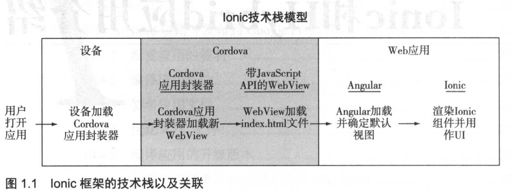
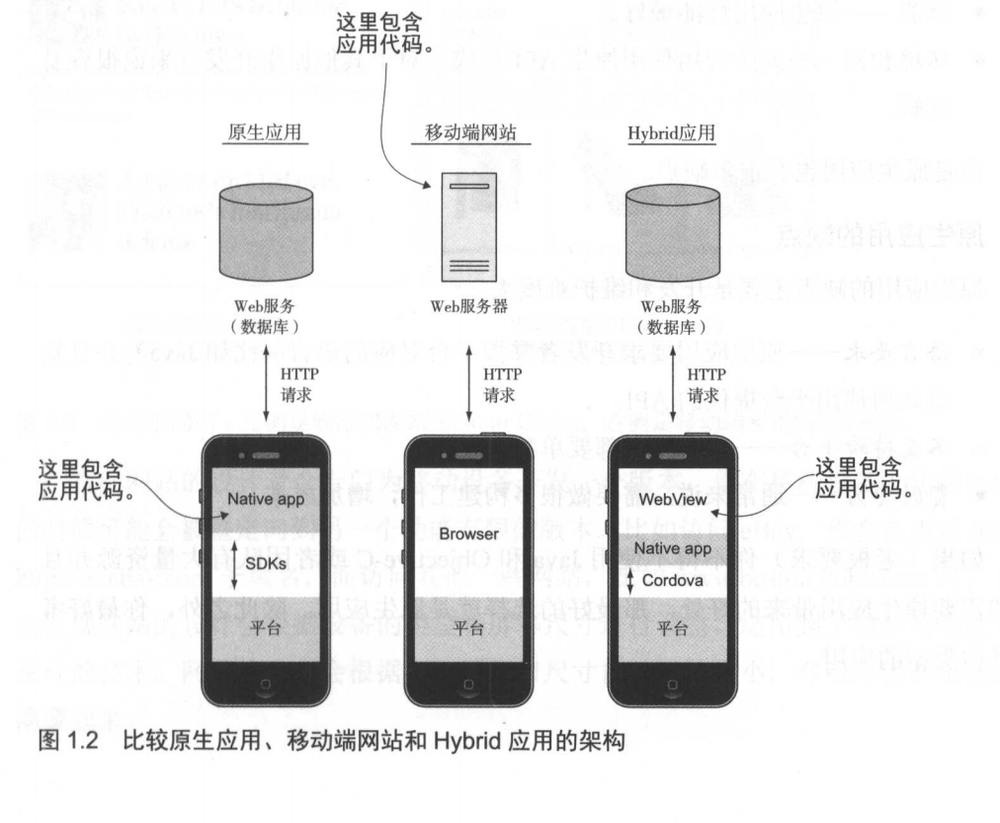
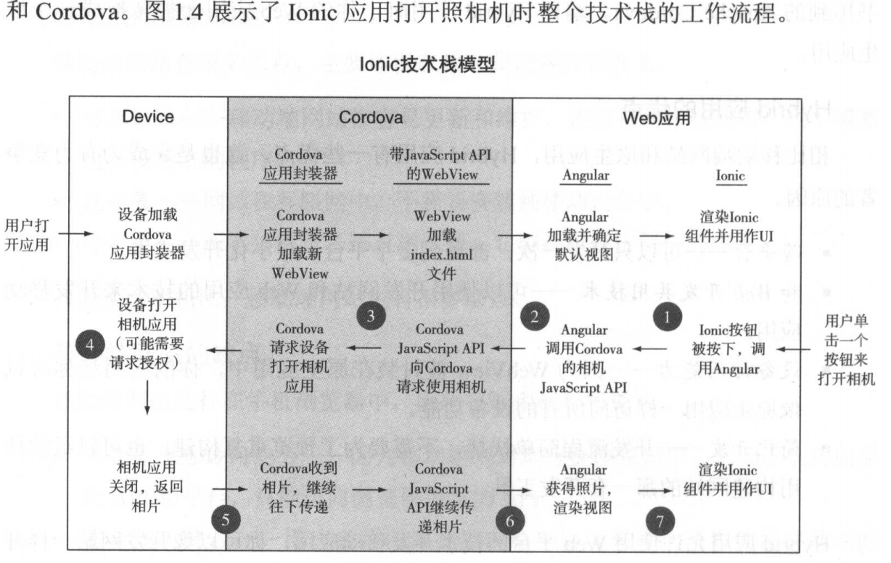

# Ionic和Hybrid应用介绍

在 `Ionic` 的帮助下，你可以构建和原生应用非常相似的 `Hybrid` 移动应用 。 Hybrid 应用指的是使用浏览器窗口展示界面的移动应用 。 Ionic 通过集成二E具和功能，让开发者可以使用构建网站和 Web 应用的技术（主要是 `HTML`、 `css` 和 `JavaScript`）快速构建 Hybrid 移动应用 。 Ionic 的工作原理是通过 `Cordova` 把一个 Web 应用嵌入原生应用。 Ionic 集成了`Angular`，用于在移动端环境中创建 Web 应用，支持包括用户界面控件和触摸输入响应在内的移动端特性。

## Ionic是什么

Ionic 通过整合各种技术和功能使构建 Hybrid 应用更加快速、容易和美观 。Ionic 的生态系统基于 `Angular` 和 `Cordova`，前者是 Web 应用框架，后者是构建和打包原生应用的工具。

- 设备

设备可以加载应用。设备中的操作系统负责安装从平台对应商店下载的应用。操作系统还会提供一系列应用可以使用的功能 API，比如 GPS 位置、通讯录列表和照相机。

- Cordova应用包装器

这是 一个能够加载 Web 应用代码的原生应用 。Cordova 是一个平台，用于构建能够执行 HTML 、 css 和 JavaScript 的 原生
应用，这种应用被称为均1brid 移动应用 。 它是平台和应用之间的桥梁，可以创建一个能够安装的原生应用（图 I.I 中被称作应用封装器）。这个原生应用中包含 WebView （实际上是一个独立的浏览器窗口），可以通过 JavaScriptAPI 来运行 Web 应用 。

- Cordova JavaScript API

这是沟通应用和设备的桥梁，应用封装器可以通过 JavaScript API 来联通 Web 应用和原生平台。具体的实现细节不用在意 ，总之最后 Cordova 会帮你生成原生应用。

- Angular 

用来控制应用路由和功能的 Web 应用 。 Angular Web 应用运行在WebView 中。 Angular 是一个流行的 Web 应用构建框架， 主要管理 Web 应用的逻辑和数据 。

- Ionic 

控制应用中用户界面组件的渲染 。 Ionic 基于 Angular 构建， 主要用来设计用户界面和用户体验 。 Ionic 包含一些视觉元素，比如选项卡、按钮、导航头部 。 这些界面控件是 Ionic 的核心，可以在 Hybrid 应用中提供接近原生界面的体验 。 Ionic 还提供了许多功能和特性，可以帮助你完成创建．预览．发布整个流程 。

## 移动开发类型

三种基础类型 ：**原生应用**、**移动端网站**和 **Hybrid 应用**.

### 原生移动应用

原生应用的好处:

- 原生API－原生应用可以在应用中直接使用原生 API，这和平台的交流最紧密。
- 性能一一原生应用性能最好。
- 环境相同一一原生应用使用原生 API 写成，对于其他原生开发者来说很容易理解.

原生应用的缺点(开发和维护难度大):

- 语言要求原一一生应用要求开发者掌握平台对应的语言（比如 Java）井且知道如何使用平台提供的 API 。
- 不支持跨平台 一一 每个平台都要单独开发。
- 费时费力一一通常来说，需要做很多构建工作，增加成本。

### 移动端网站（ Web 应用）

移动端网站的优点:

移动端网站有很多优点 ， 主要体现在 **效率** 和 **设备兼容性**上 。

- 可维护性一一移动端网站很容易更新和维护，没有任何审核流程，也不需要更新设备上的程序。
- 免安装一一网站在互联网中，不需要安装到移动设备中 。
- 跨平台一一所有移动设备都有浏览器，它们都可以访问你的应用 。

移动端网站的缺点:

移动端网站运行在于机浏览器中，因此有很多限制和缺点 。

- 不具备原生访问能力一一因为移动端网站运行在浏览器中，它们不能访问原生 API 和平台，只能访问浏览器提供的 API 。
- 需要使用键盘一一用户必须在浏览器中输入地址来寻找或者使用移动端网站，这比单击一个图标困难多了 。
- 受限的用户界面 一一很难创建对触摸友好的应用，尤其是当要同时兼容桌面版时 。
- 移动端访问量下降一一用户在移动设备上访问网站的时间不断减少，使用应用的时间越来越多。

### Hybrid应用

Hybrid 应用指的是包含独立浏览器实例的移动应用，这个实例通常被称作 WebView，可以在原生应用中运行 Web 应用。 Hybrid 应用会使用原生应用封装器来实现WebView 和原生设备平台的通信。这意味着 Web 应用可以运行在移动设备上，并且可以访问设备的功能，比如照相机和 GPS 。

Hybrid 应用的优点:

- 跨平台一一可以只开发一次，部署到多个平台 ，最小化开发成本 。
- 和 Web 开发共用技术一一可以使用开发网站和 Web 应用的技术来开发移动应用。
- 设备访问能力 一一因为 WebView 被封装在原生应用中，你的应用让你可以像原生应用一样访问所有的设备功能。
- 简化开发一一开发流程简单快捷，不需要为了预览重复构建。也可以继续使用构建网站的那一套开发工具。

Hybrid 应用的缺点:

- WebView 限制 应用只能运行在 WebView 实例中，这意味着应用的性能取决于浏览器 。
- 通过插件访问原生功能一一你需要的原生 API 现在可能还没有插件实现，可能需要一些额外的开发工作来进行桥接。
- 没有原生用户界面控件 如果没有 Ionic 这样的工具，开发者需要创建所有的用户界面元素。

有了 Ionic，你可以使用 Web 开发者己经熟悉的知识和技能来构建 Hybrid 应用 。

## 理解Ionic技术栈

Ionic、Angular、Cordova

### Ionic:用户界面框架

Ionic 的主要特征就是一组用户界面控件

### Angular : Web 应用框架

Angular （也被称为 An伊larJS ）是谷歌的一个开源项目，在 Web 应用开发者中非常有名。它提供了良好的应用架构，可以帮助 Web 开发者快速开发完整应用

### Cordova : Hybrid 应用框架

主要任务是实现浏览器窗口和原生 API 的通信

## 为什么选择 Ionic

### 开发者为什么要选择 Ionic

Ionic 可以为 Hybrid 应用提供看起来和用起来都很像原生应用的体验 。 长久以来，大家都认为只有原生应用才能做到速度快和功能丰富，但是这个观点己经被证明是错误的 。大家都希望自己的移动应用速度快、运行流畅井且好看， Ionic 应用可以 ：

- 在 Web 平台上开发应用一一你可 以使用 HTML 、 css 和 JavaScript 开发类似原生应用的 Hybrid 应用。
- 使用 Angular 开发 一一对于那些熟 悉 Angular (或者像 Ember 这样的框 架）的人来说， Ionic 是一个不错的选择 。 Ionic 使用 Angular 进行开发，所以你可以使用 Angular 的全部功能以及所有第三方模块 。 Angular 的目标是开发主流应用， Ionic 把 Angular 扩展到了移动领域。
- 使用现代技术一－Ionic 使用现代的 CSS3 特性进行开发，比如动画 。移动端浏览器对 Web 平台新规范的支持更好，因此你可以使用这些新特性。
- 社区支持和开源精神
- 强大的 CLI 工具一一有了 CLI 工具，你可以快速管理开发任务，比如在浏览器中预览应用、模拟运行应用或者把应用部署到连接的设备中 。 你还可以用它创建和设置项目。
- Ionic 服务一一Ionic 提供了许多辅助开发的服务。 Ionic Creator 服务可以让你用拖曳界面的方式设计和导出应用。 Ionic 视图服务可以帮你把 beta 版应用发布给客户和测试用户。总之， Ionic 不仅是创建 Hybrid 应用的基础工具，也是帮助你提高效率的开发者工具 。
- Ionic 有一个专职团队一一开源项目的 隐患之一就是你不确定它是否能获得持续开发和支持。 Ionic 有一个专职团队，他们会不断推动平台发展 。
- 类似原生的体验一一使用 Ionic 可以创建类似原生应用的体验，用户更容易使用你的应用。
- 性能一一Ionic 性能不比原生应用差；性能越好，用户越开心 。
- 美观、可定制的设计一一用户界面组件是按照原生风格精心设计的，你也可以轻松地针对应用进行自定义。

### Ionic 的缺点

- 平台限制一一Ionic 1.0 目前只支持 iOS 和均由oid 平台，像 Windows Phone和 Firefox OS 这样的平台未来可能会支持，不过无法保证。
- 不支持老平台一－Ionic 只保证支持 iOS 7＋和 Android 4＋。
- 不等于原生一一原生设备 API 必须在 Cordova 支持之后才能使用 。如果你需要和设备深度集成，用 Ionic 很难实现。
- 不能应付大量图像一一因为运行在浏览器中， Hybrid 应用天生就有这个限制。如果你想做游戏应用或者需要操作大量图像，那 Hybrid 应用环境并不合适， 需要使用原生应用环境。

## 使用 Ionic构建应用的前提

### 掌握 HTML, CSS 和 JavaScript

 HTML 指定内容结构， css 提供样式设计， JavaScript 提供 Web 应用必需的交互和逻辑

### 掌握 Web 应用和 Angular

### 拥有移动设备

## Ionic支持的移动设备和平台

现有的移动平台一一iOS 、 Android、 Windows 8 、 Firefox OS 、 Tizen 、 黑莓等