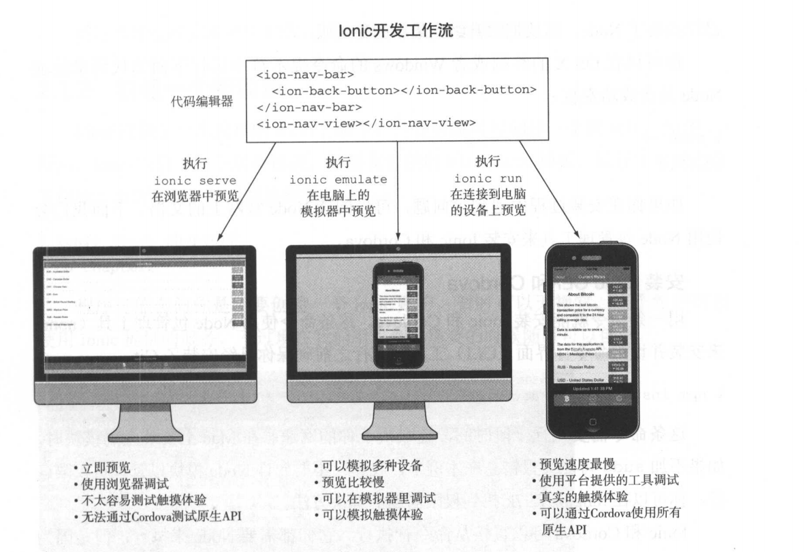

# 配置开发环境

## 快速上手

### 设置开发环境



开发环境需要的软件:

- Node.js
- Ionic CLI
- Cordova

```shell
npm install -g cordova ionic
# ionic -v
# cordova -v
# 更新
# npm update - g ionic
# npm update -g cordova
```

### 创建一个新项目

```
ionic start chapter2
# 暂选择sidemenu模板
cd chapter2
ionic --help
```

### 项目文件夹结构

Cordova 相关 的文件和 目录是 con:fig.xml、 hooks 、platforms 、 plugins 和 WWW ，剩下的都是 Ionic创建的，(新版本ionic变换了目录结构) 。 Ionic 使用 Bower 和 npm 管理项目依赖 。

- Bower和npm

Bower 和 npm 都是包管理工具，可以用来下载 Web 应用所需的额外文件 。
Bower 的目的是帮助你管理项目中的前端文件，比如 jQuery和 Bootstrap, npm 的目的是管理 Node 项目或者 Node 应用所需的包 。
在 Ionic 中，前端的 Ionic 代码使用 Bower 加载， Gulp 依赖使用 npm 加载 。

- Cordova

Cordova 会使 用 config.xml 生成平台文 件， 其中包含的信息有作者 、 全局设置、平台对应设置、 可用插件等 。 

- www

WWW 目录包含 WebView 中需要运行的所有 Web 应用文件。它会假设目录中存在 index.html 文件，除了这个限制，其他文件你可以随意组织。 Ionic 默认会创建一个基础的 AngularJS 应用供你使用 

### 在浏览器中预览

```
ionic serve
# 默认是8100端口
```

## 配置预览环境

如何在模拟器和设备上预览项目。这两种方式和在浏览器中预览不同，可以模拟移动设备的使用场景。模拟器是虚拟设备，通过在容器中运行移动平台（比如 Android ）来模拟真实物理设备的使用场景 。 设备预览需要通过 USB 接 口连接你的物理设备，然后直接把应用安装上去。

要配置预览环境，需要:

- 安装构建应用需要的平台工具
- 下载并配置模拟器
- 把设备连接到电脑
- 针对每个支持的平台配置项目并预览

### 安装平台工具

平台| 软件 | where
:-:|:-:|:-:
IOS|Xcode|Mac的Appstore搜索Xcode
Android| Android Studio|http://developer.android.com/sdk/index.html

android sdk设置环境变量

ANDROID_HOME

%ANDROID_HOME%/tools 添加到Path

### 配置模拟器

#### 配置IOS模拟器

IOS Simulator

#### 配置Android模拟器

AVD

### 配置连接设备

#### 配置IOS设备

关联账号

#### 配置Android设备

开发者模式->开发者选项开启USB调试

### 给项目添加平台

```
$ ionic platform add ios
$ ionic platform add android
```

不过新版本ionic变成了

```
$ ionic cordova platform
$ ionic cordova platform add ios
$ ionic cordova platform add android
$ ionic cordova platform rm ios
```

### 在模拟器中预览

在Mac上模拟还需要安装iod-sim: `npm install - g ios-sim`

使用`emulate`命令在模拟器中运行应用:

```
ionic emulate ios
ionic emulate android
```

新版本ionic变成了:

```
ionic cordova emulate ios
ionic cordova emulate android
```

使用热加载

```
ionic  cordova emulate ios -l -c
ionic cordova emulate android -l -c
```

### 在移动设备中预览

```
ionic  run ios -1 -c
ionic  run android -1 -c
```

#### 部署到设备

```
ionic  build android
```

## 总结