# ANgularJS必备知识

## AngularJS初探

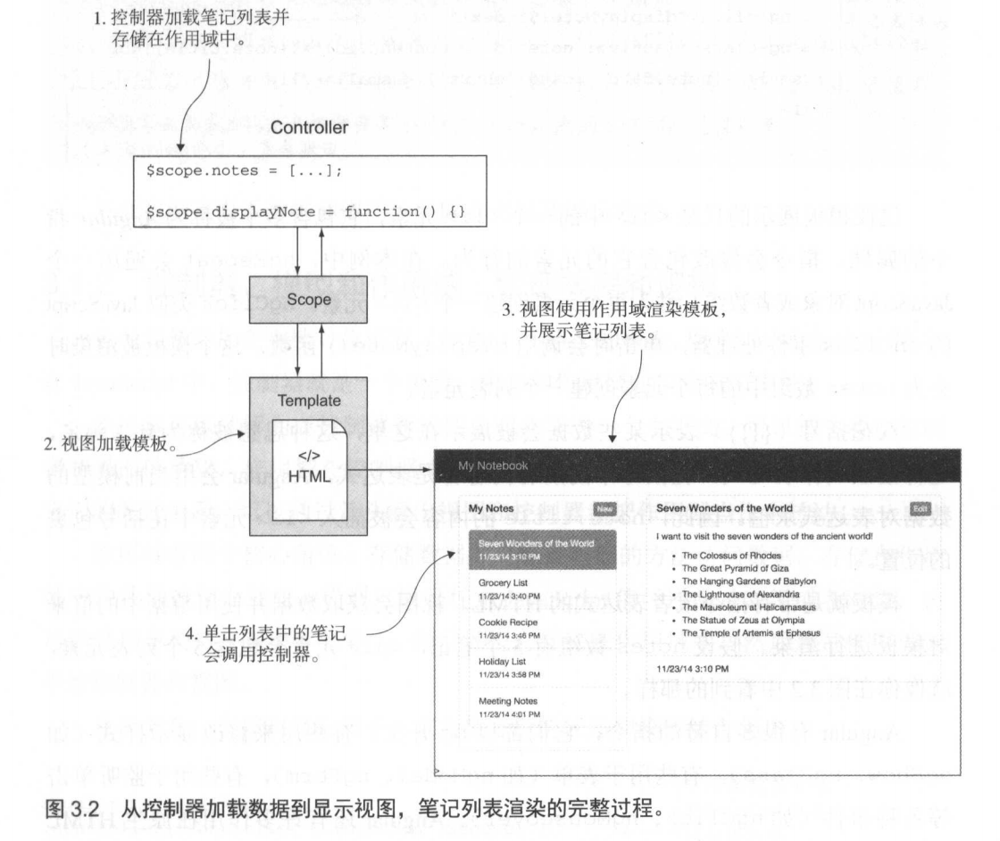

### 视图和模板: 描述内容


### 控制器、模型和作用域：管理数据和逻辑

**控制器**是附加在文档对象模型（DOM）节点上的函数 ， 用来驱动你的应用逻辑 。在 JavaScript 中，控制器就是一个函数 ，用来和作用域通信并响应事件。

**作用域**可以理解为在控制器和视图之间共享的一个上下文。可以把它看作控制器和界面的桥梁，作用域在控制器中更新时也会更新视图。

作用域有两个核心角色 ： 存储数据井允许控制器的方法访问数据。存储在作用域中的数据被称为模型 。 模型可以是任意 JavaScript 值（通常是数组或者对象 ， 也可以是简单的数字或者字符串），你可以把它存储在作用域中，然后通过作用域共享给控制器和视图。

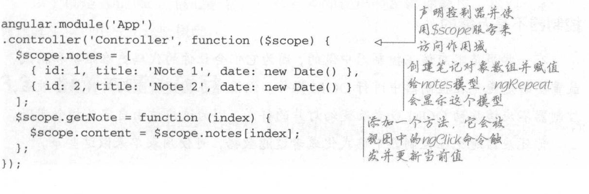

### Service ：可重用的对象和方法

Angular 中有一个概念叫 service，它本质上就是一个 JavaScript 对象，可以在整个应用中共享。

$http 是一个非常常见的 service, Angular 用它来操作 HTTP 请求。它有很多方法，比如 get()、 post()和其他的 HTTP 动作。

service 是由 Angular 延迟加载的，也就是说，它们只会在使用的时候才载入内存。 它们还是单例的，如果你在一个地方改变了 service 的值，其他用到这个 service的地方都会受影响 。

### 双向数据绑定：在控制器和视图之间共享数据

Angular 最强大的特性之一就是双向数据绑定。你己经看到了视图如何把数据绑定到模板，其实反过来同样适用 。 视图可以改变作用域中的数据，数据会立刻更新到作用域井反应到控制器中 。 这在表单中尤其有用，用户向文本框中输入内容时作用域中的值会同步更新 。 你不需要做任何特殊的事情来启动双向数据绑定一一它会自动实现 。

## 配置本章项目

- 在JSON 文件中存储笔记 。
- 展示 、创建 、 修改和删 除笔记 。
- 在笔记中使用 Markdown 格式 。
- 同步编辑和预览 Markdown 。

### 获取项目文件

```
$ git clone https://github.com/ionic-in-action/chapter3.git
$ cd chapter3
$ git checkout step1
```

### 启动开发服务器

```
npm install
node server
```

## Angular 应用基础

Angular 开发简单来说就是用 JavaScript 创建一个 Angular 应用并在 HTML 中使用它 。 Angular 和页面的 DOM 紧密结合，所以你可以把一个 Angular 应用严格限制在一个 DOM 元素及其子元素中 。 在本例中使用的是`<html>`元素，所以 Angular可以访问整个页面 。 Ionic 通常使用的是`<body>`元素 。

```
git checkout -f step2
```

```
<html lang="en" ng-app="App">  // index.html

angular.module('App', []);  // js/app.js

<script src="js/app.js"></script>  // index.html
```

## 控制器：控制数据和业务逻辑

```git
git checkout -f step3
```

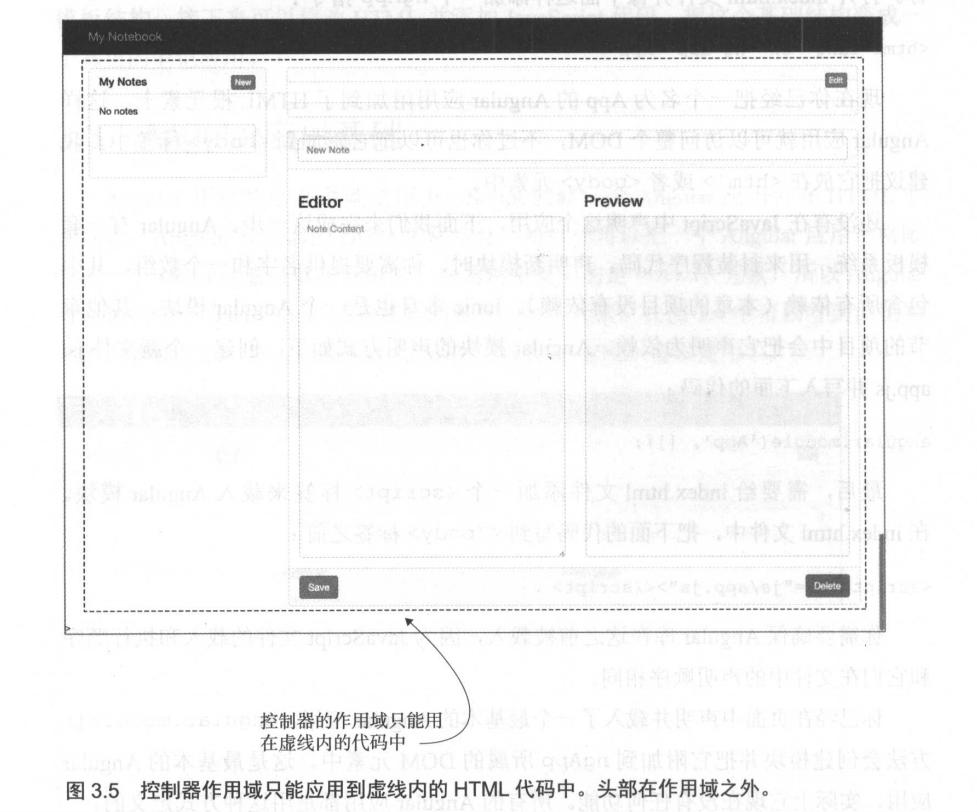

首先你需要引用 App 模块并使用控制器方法来声明一个控制器。需要传入控制器的名字以及一个包含控制器逻辑的函数。创建一个新文件 `js/editor.js`

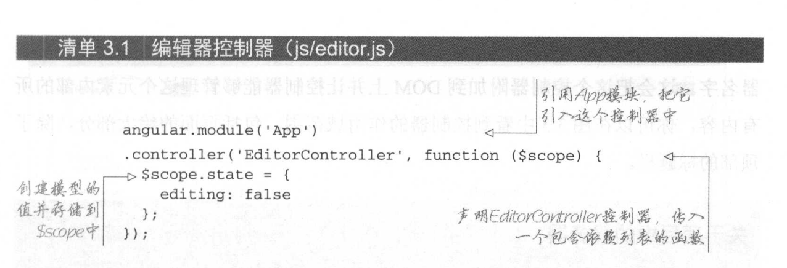

```js js/editor.js
angular.module('App')
.controller('EditorController', function ($scope) {
  $scope.editing = true;
});
```

```html
<div class="container" ng-controller="EditorController"> 

<script src="js/editor.js"></script>
```

### 加载数据：使用控制器来加载数据并显示在视图中

```git
git checkout -f step4
```

```js js/editor.js
angular.module('App')
.controller('EditorController', function ($scope, $http) {
  $scope.editing = true;

  $http.get('/notes').success(function (data) {
    $scope.notes = data;
  }).error(function (err) {
    $scope.error = 'Could not load notes';
  });

});
```

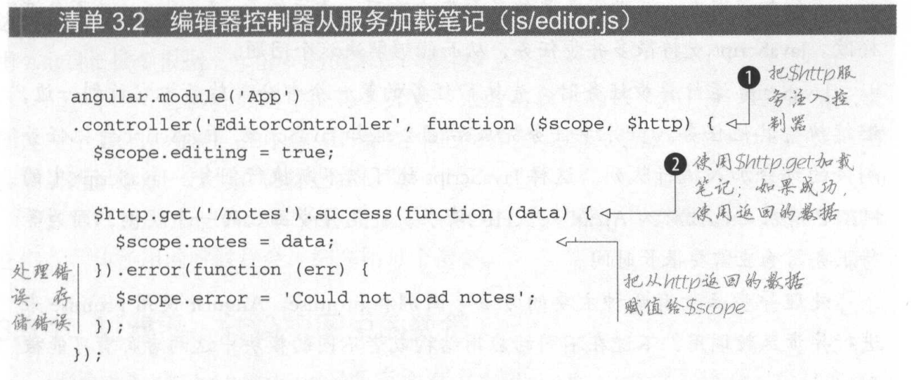

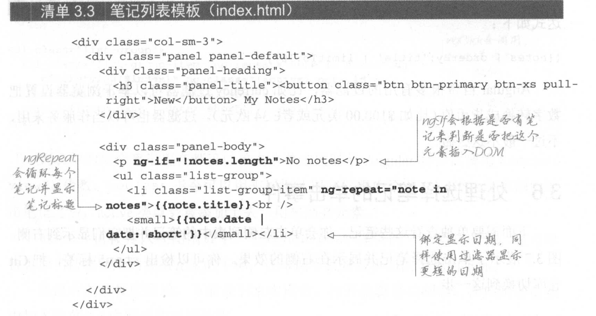

### 过滤器：转换视图中的数据

模板中绑定的 `note.date` 数据后面有个 `| date: 'short'`，这是一个过滤器，它会在不改动作用域值的前提下修改显示内容。

## 处理选择笔记的单击事件

```git
git checkout -f step5
```

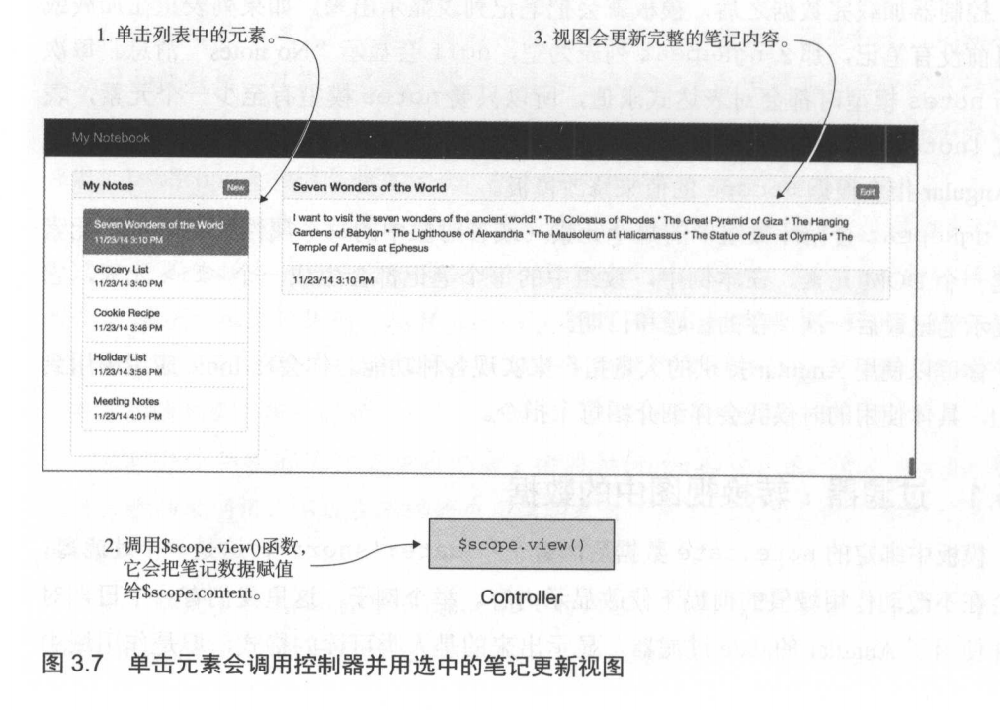

```html
<ul class="list-group">
                <li class="list-group-item" ng-repeat="note in notes" ng-click="view($index)" ng-class="{active: note.id == content.id}">{{note.title}}<br />
                <small>{{note.date | date:'short'}}</small></li>
              </ul>
```

```js editor.js
  $scope.view = function (index) {
    $scope.editing = false;
    $scope.content = $scope.notes[index];
  };
```

```git
git checkout -f step6
```

```html
<div class="panel panel-default" ng-hide="editing">
            <div class="panel-heading">
              <h3 class="panel-title">{{content.title}} <button class="btn btn-primary btn-xs pull-right">Edit</button></h3>
            </div>
            <div class="panel-body">{{content.content}}</div>
            <div class="panel-footer">{{content.date | date:'short'}}</div>
          </div>
          <form name="editor" class="panel panel-default" ng-show="editing">
```

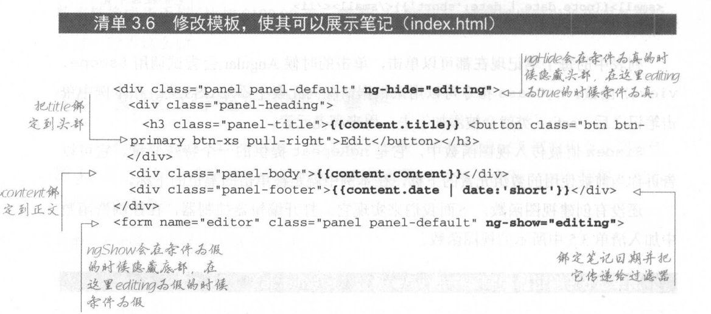

## 创建一个指令，用来解析Markdown格式的笔记

```git
git chekcout -f step7
```

```js app.js
angular.module('App', [])
.directive('markdown', function () {
  var converter = new Showdown.converter();
  return {
    scope: {
      markdown: '@'
    },
    link: function (scope, element, attrs) {
      scope.$watch('markdown', function () {
        var content = converter.makeHtml(attrs.markdown);
        element.html(content);
      });
    }
  }
});
```

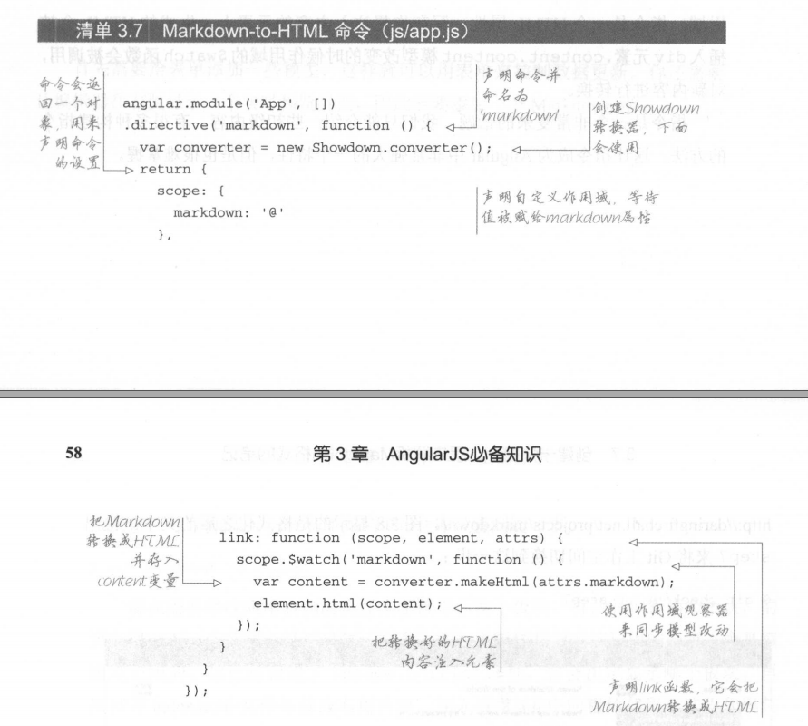

```html
<div class="panel-body" markdown="{{content.content}}"></div>
```

## 使用模型来管理内容编辑

```git
git checkout-f step8
```

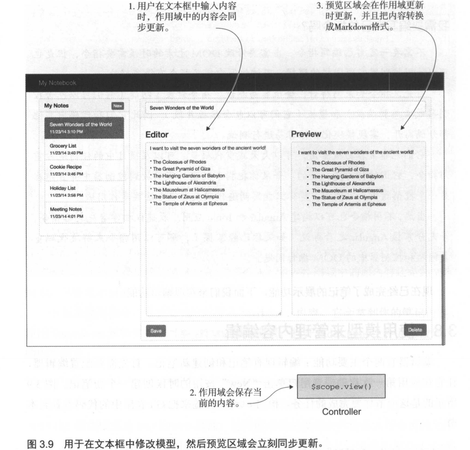

```html
<form name="editor" class="panel panel-default" ng-show="editing">
            <div class="panel-heading">
              <h3 class="panel-title"><input type="text" class="form-control" ng-model="content.title" placeholder="New Note" required /></h3>
            </div>
            <div class="panel-body">
              <div class="row">
                <div class="col-sm-6">
                  <h3>Editor</h3>
                  <textarea class="form-control editor" rows="10" ng-model="content.content" placeholder="Note Content" required></textarea>
                </div>
                <div class="col-sm-6">
                  <h3>Preview</h3>
                  <div class="preview" markdown="{{content.content}}"></div>
                </div>
              </div>
            </div>
            <div class="panel-footer">
              <button class="btn btn-primary">Save</button>
              <button class="btn btn-danger pull-right">Delete</button>
            </div>
          </form>
```

```html
<h3 class="panel-title"><button class="btn btn-primary btn-xs pull-right" ng-click="create()">New</button> My Notes</h3>
```

```html
<h3 class="panel-title">{{content.title}} <button class="btn btn-primary btn-xs pull-right" ng-click="editing = true">Edit</button></h3>
```

```js editor.js
  $scope.create = function () {
    $scope.editing = true;
    $scope.content = {
      title: '',
      content: ''
    };
  };
```

## 保存和删除笔记

```git
git checkout -f step9
```

### 添加save()方法

```js
  $scope.save = function () {
    $scope.content.date = new Date();

    if ($scope.content.id) {
      $http.put('/notes/' + $scope.content.id, $scope.content).success(function (data) {
        $scope.editing = false;
      }).error(function (err) {
        $scope.error = 'Could not upate note';
      });
    } else {
      $scope.content.id = Date.now();
      $http.post('/notes', $scope.content).success(function (data) {
        $scope.notes.push($scope.content);
        $scope.editing = false;
      }).error(function (err) {
        $scope.error = 'Could not create note';
      });
    }
  };
```

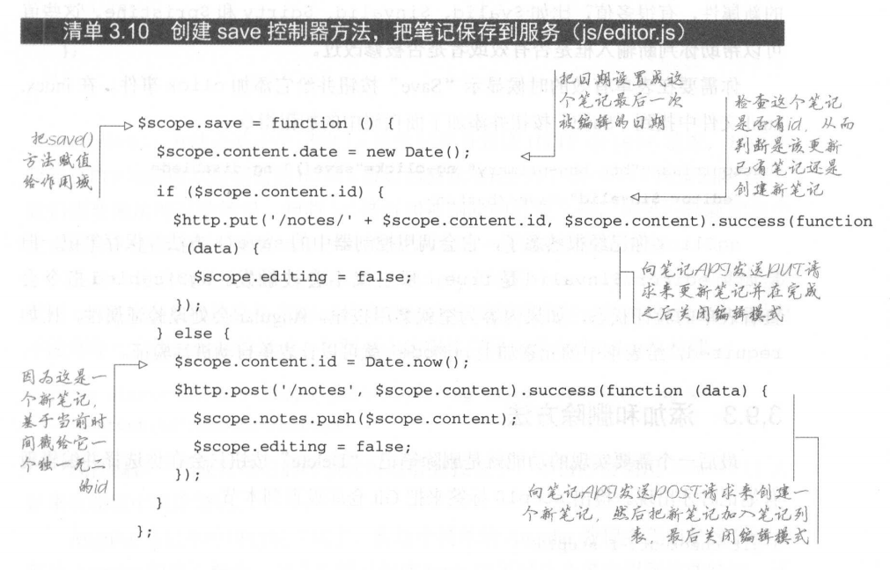

## 使用 Angular 表单进行验证

```html
 <button class="btn btn-primary" ng-click="save()" ng-disabled="editor.$invalid">Save</button>
```

### 添加删除方法

```git
git checkout -f step10
```

```js
  $scope.remove = function () {
    $http.delete('/notes/' + $scope.content.id).success(function (data) {
      var found = -1;
      angular.forEach($scope.notes, function (note, index) {
        if (note.id === $scope.content.id) {
          found = index;
        }
      });
      if (found >= 0) {
        $scope.notes.splice(found, 1);
      }
      $scope.content = {
        title: '',
        content: ''
      };
    }).error(function (err) {
      $scope.error = 'Could not delete note';
    });
  };

```


```html
<button class="btn btn-danger pull-right" ng-click="remove()" ng-if="content.id">Delete</button>
```