# 选项卡、高级列表和表单组件

这次要构建的应用需要显示比特币和其他货币的实时汇率以及历史汇率。界面会使用 Ionic 的选项卡组件，其中包含三个选项卡 ： 查看当前市场汇率、查看历史汇率图表以及资金管理。

你会学到如何在选项卡中使用导航窗口。如果你想在使用选项卡的同时维护用户界面状态，那么掌握这个技术非常重要。你还会学到如何在不同选项卡中缓存外部来源加载的数据，这样可以提高加载速度，避免不必要的 HTTP 请求 。

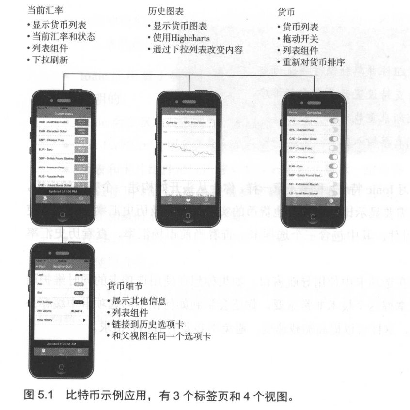

## 配置项目

```
$ git clone https://github.com/ionic-in-action/chapter5.git
$ cd chapter5
$ git checkout -f stepl
$ ionic serve
```

## ionTabs: 添加选项卡和导航

添加基础的导航元素 ： ionNavBar 和 ionNavView 组件 。ionNavBar 可以根据当前选项卡自动更新标题栏 ， ionNavView 会显示 tabs 模板 .

```
git checkout -f step2
```

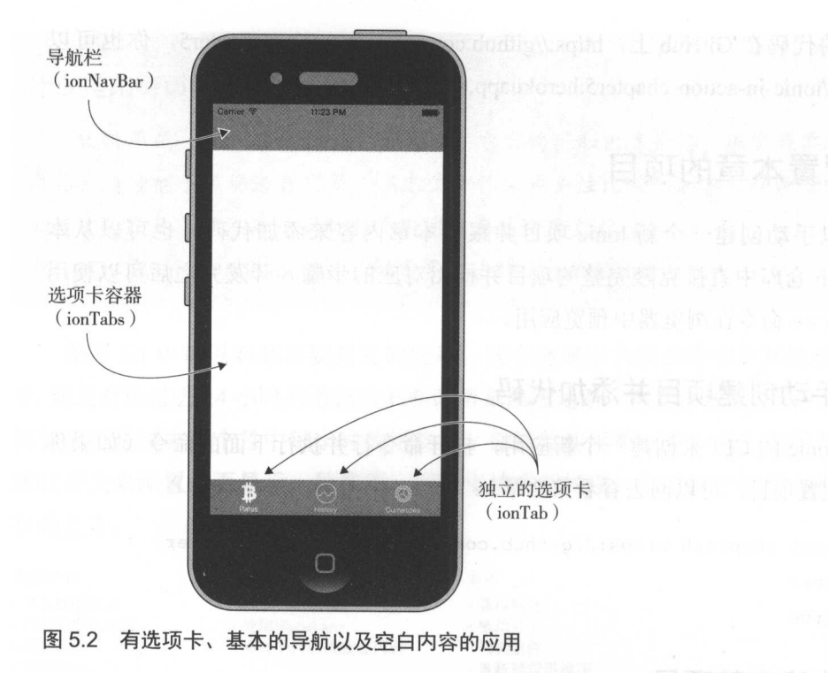

- index.html中添加导航组件

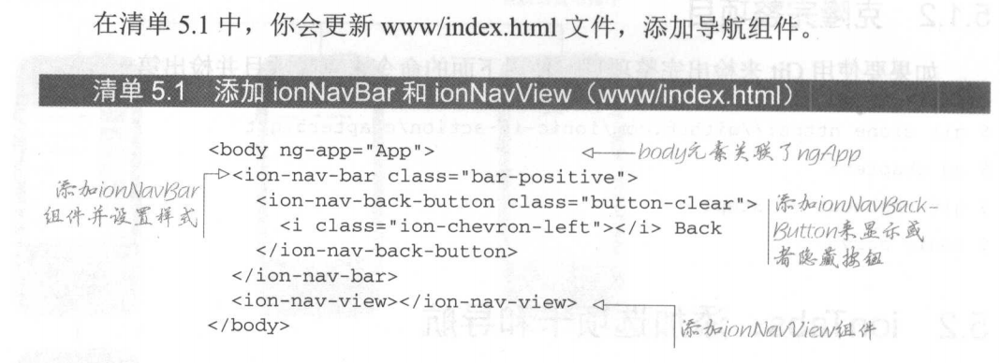

- 添加路由

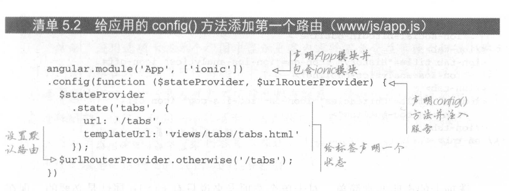

### 给应用添加选项卡容器和三个选项卡

你可以在应用的任何位置使用选项卡，除了 ionContent 指令，因为在 ionContent 中使用ionTabs 会导致 css 冲突 。

Ionic 提供了两个选项卡组件： ionTabs 和 ionTab 。和工 onSlideBox 一样，首先要声明 ionTabs ，然后在内部声明多个 ionTab。

- tabs.html

```html
<ion-tabs class="tabs-icon-top tabs-positive">

  <ion-tab title="Rates" icon-on="ion-social-bitcoin" icon-off="ion-social-bitcoin-outline">
  </ion-tab>

  <ion-tab title="History" icon-on="ion-ios-analytics" icon-off="ion-ios-analytics-outline">
  </ion-tab>

  <ion-tab title="Currencies" icon-on="ion-ios-cog" icon-off="ion-ios-cog-outline">
  </ion-tab>

</ion-tabs>

```

### 给每个选项卡添加 ionNavView

```
git checkout -f step3
```

首先你需要向选项卡中添加 ionNavView 组件，需要分别给这些组件设置一个名字，从而可以引用它们。在 Ionic 应用中，只能有一个未命名的 ionNavView,并且它一定是默认视图。每个选项卡还会有一个 ui-sref 属性，用来把选项卡图标转换成按钮，从而可以在选项卡之间切换。

- 更新tabs.html模板文件

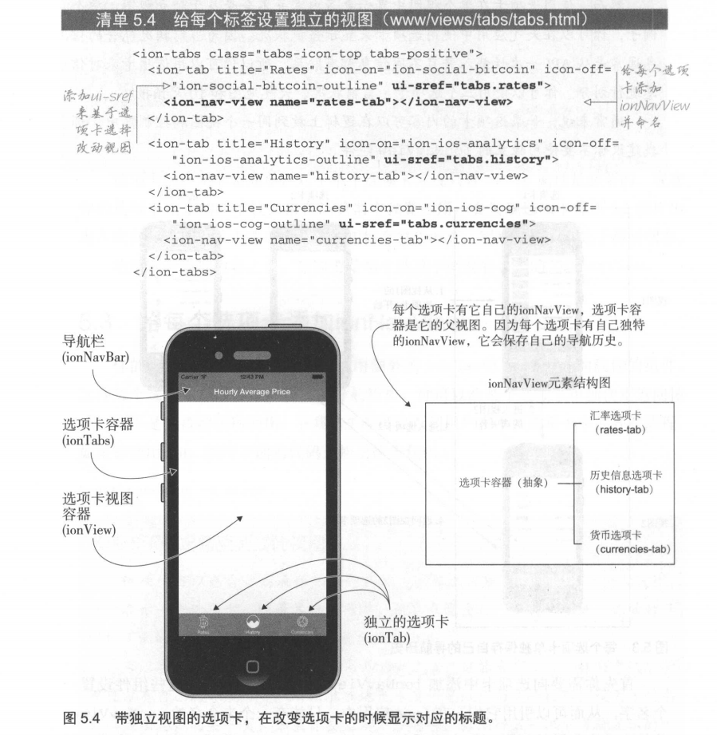

- 在config中设置状态

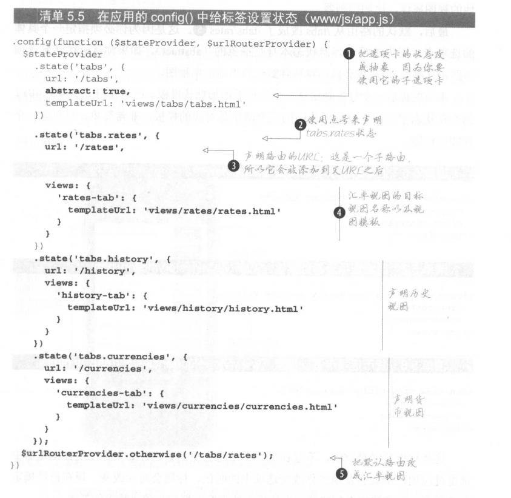

- 给选项卡添加默认模板

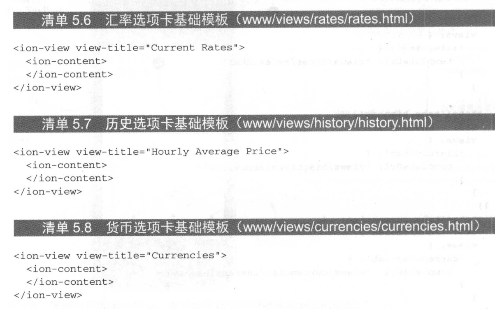

## 加载并显示当前的比特币汇率

```
git checkout -f step4
```

为了辅助你实现货币列表，首先需要创建一个 Currencies 服务。这非常简单一一只是一个数组，包含应用支持的货币一－但是因为它是一个服务，所以可以在应用的不同位置重用它。

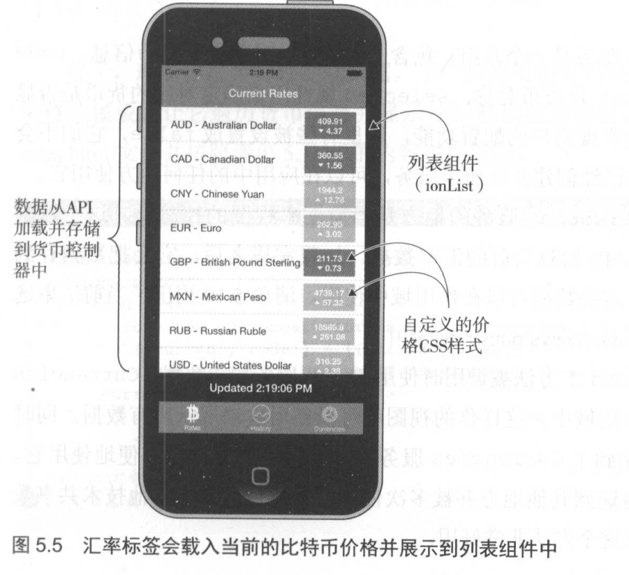

- Currencies服务

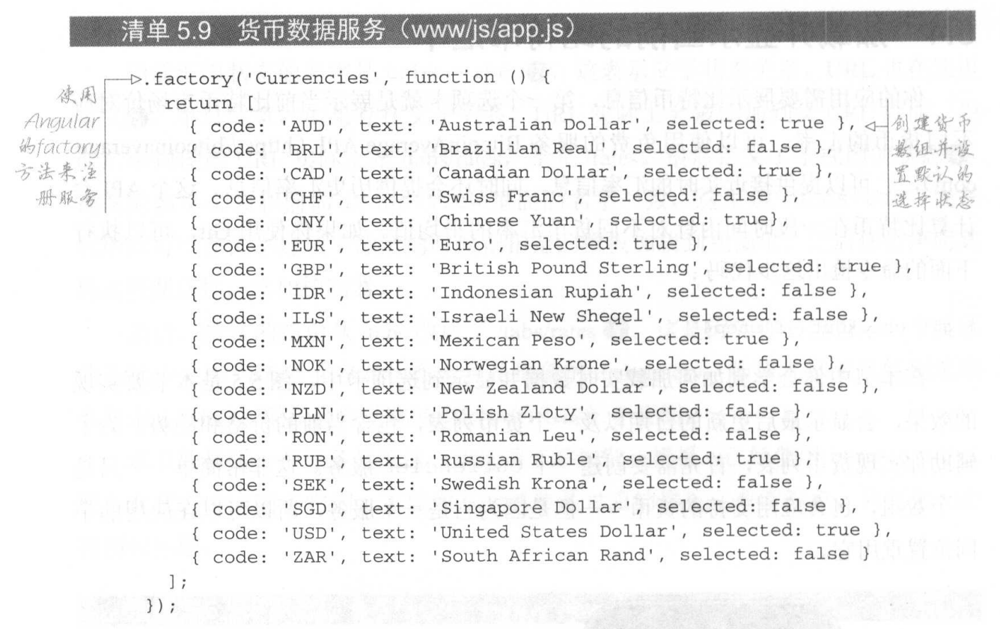

- 汇率选项卡控制器,加载数据

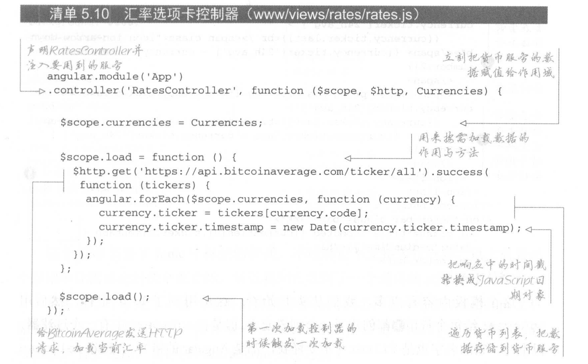

- 显示数据

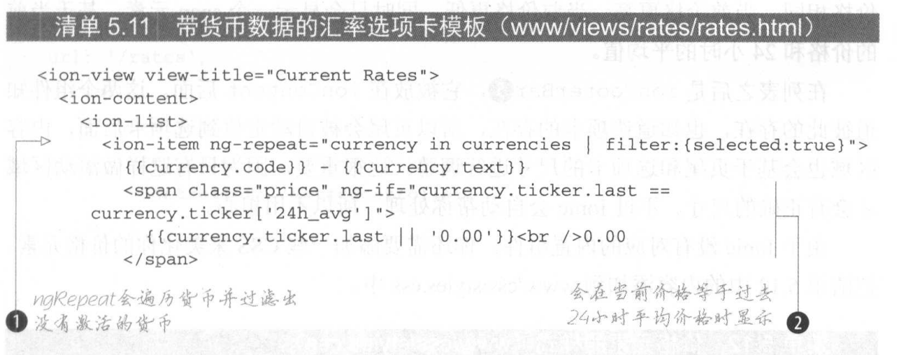

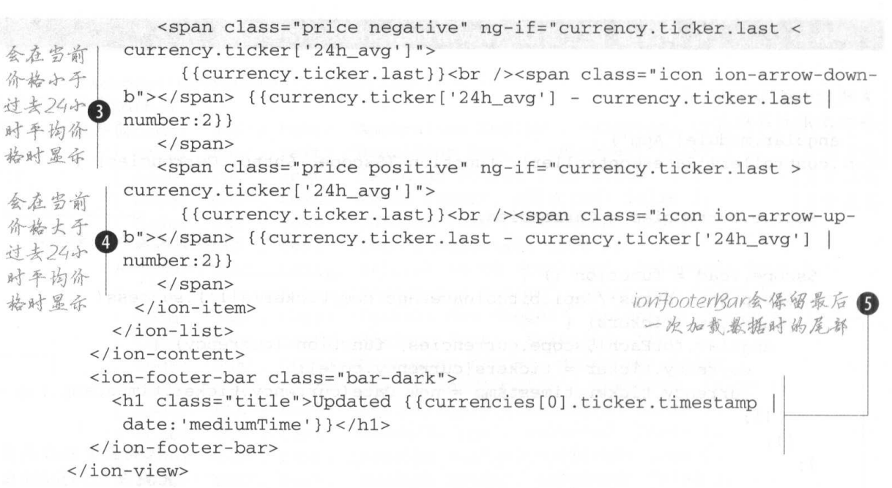

- 添加css

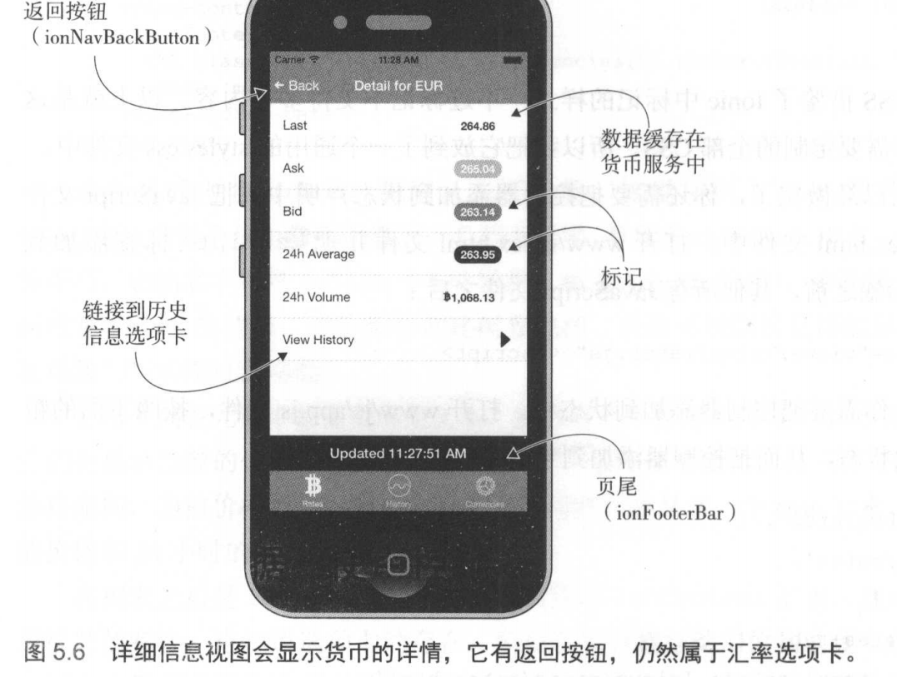

```css css/style.css
.item .price {
  font-weight: bold;
  font-size: 13px;
  color: #fff;
  position: absolute;
  background: #666;
  right: 15px;
  height: 42px;
  top: 5px;
  width: 80px;
  text-align: center;
  padding: 6px;
  line-height: 1.2em;
}
.item .price.positive {
  background: #66cc33;
}
.item .price.negative {
  background: #ef4e3a;
}
```

然后把`rates.js`添加到1index.html1中

- 把控制器添加到状态中

```js js/app.js
    .state('tabs.rates', {
      url: '/rates',
      views: {
        'rates-tab': {
          templateUrl: 'views/rates/rates.html',
          controller: 'RatesController'
        }
      }
    })
```

## 在同一个选项卡视图中显示货币细节

```
git checkout -f step5
```


- 详情控制器

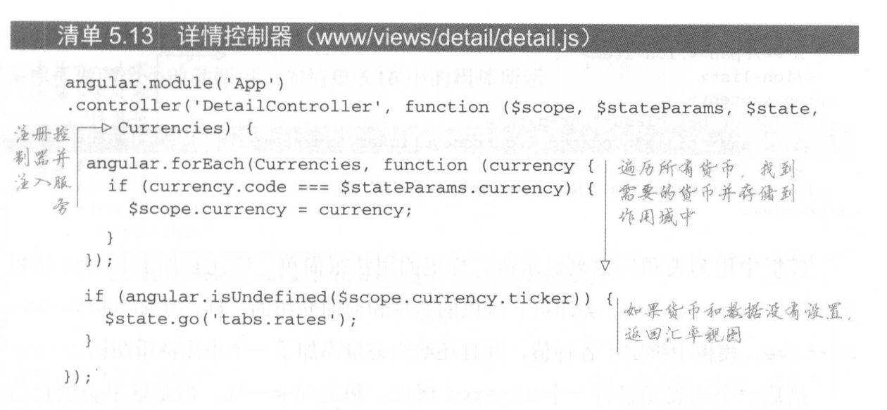

- 详情模板

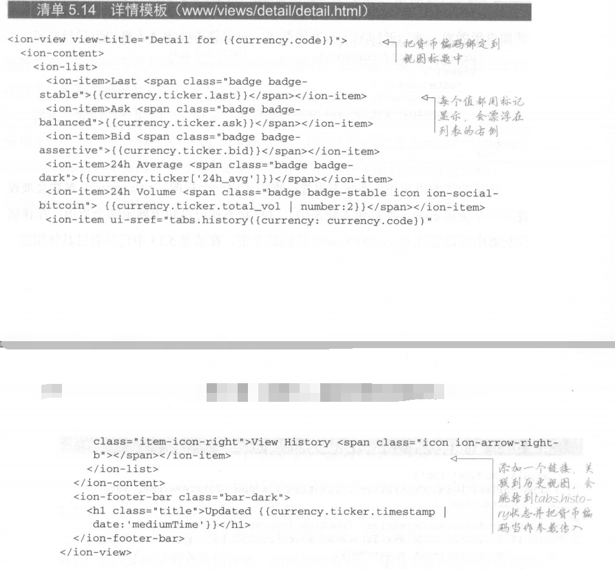

模板中用列表和标记来显示值。标记的用法很简单 ， 给元素加上 `badge` 类和预设的 `badge-[color]`类即可

最后一个列表元素有一个 `ui-sref` 属性，和选项卡一样 。 但是这里会把它当作函数使用井传入一个对象，这样就可以给其他状态传递参数.

- 将detail.js添加到index.html,在app.js声明新状态detail

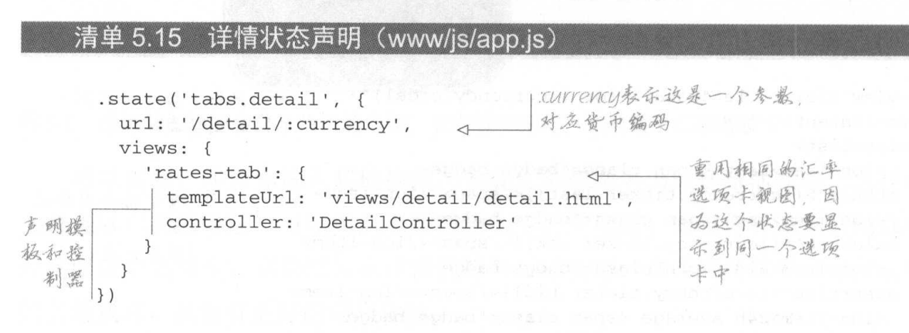

这里的状态声明和汇率状态很像，重用了同一个视图 : curreηcy 参数会被设置为一个货币 code，然后传入状态中，这样状态就可以知道展示哪个货币 。在详情控制器中可以通过 $stateParams 访问这个值.

- 更新汇率模板

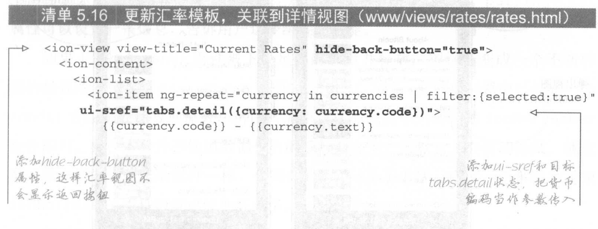

## 刷新比特币汇率并显示帮助信息

常用的方法是添加`ionRefresher` 组件，这样用户就可以在屏幕上下拉并松手，触发数据刷新。
你还需要给用户提供一个快速帮助界面，告诉他们屏幕上都是什么东西。可以使用 `ionPopoverView` 组件来显示帮助信息。

### lonRefresher ：下拉刷新汇率

- 给汇率模板添加ionRefresher

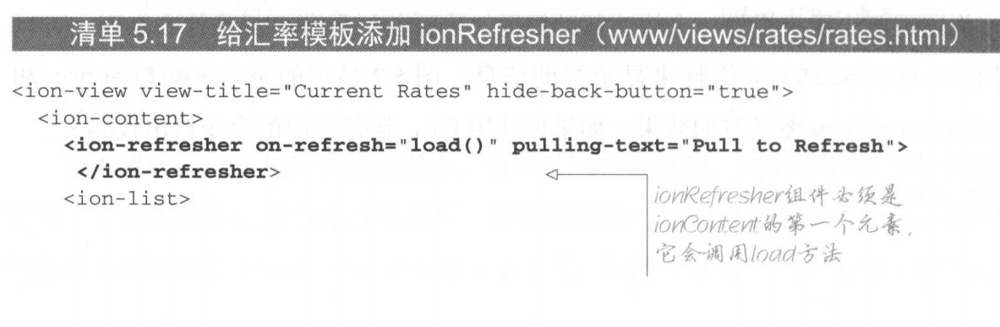

- 更新load方法

组件本身并不知道数据什么时候加载完毕，所以它不会自动隐藏 ， 就像第 4 章介绍的无限漆动组件一样。你需要修改 load()方法，广播一个事件来通知ionRefresher 组件数据已经加载完毕。

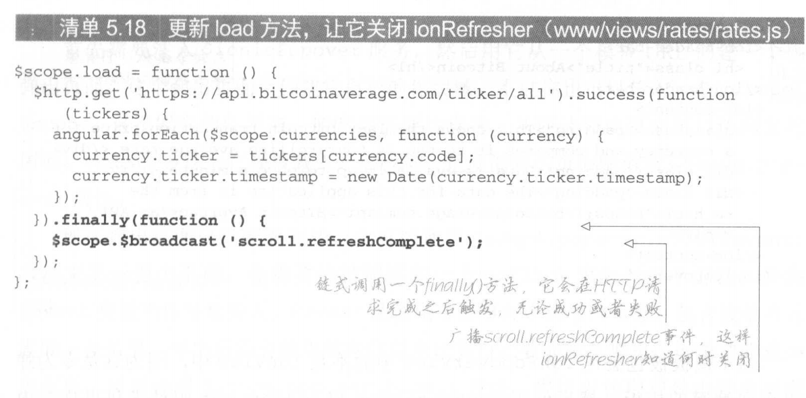

### $ionicPopover ：弹出帮助信息

$ionicPopover 组件一般会在页首显示一个按钮，单击按钮可以弹出一个页面.

- 弹出框模板

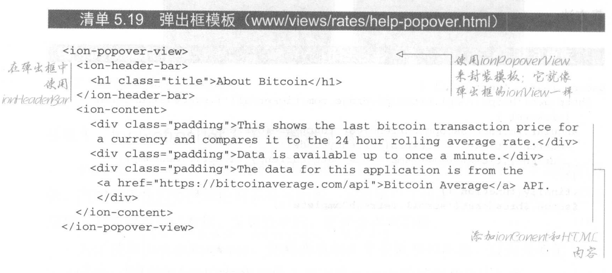

- 把弹出框注册到控制器

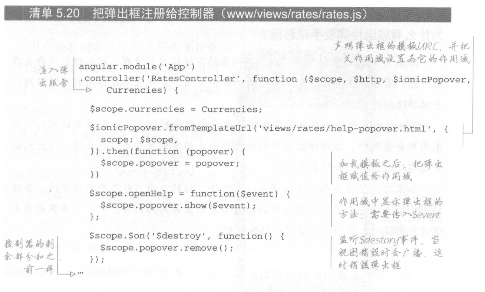

- 添加按钮来触发弹出框

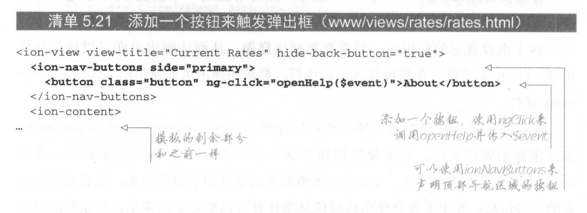

## 绘制历史数据

你会用到流行的 `Highcharts` 绘图库和一个 Angular的 Highcharts 命令 `highcharts-ng`.

### 配置第三方库

你的应用需要使用第三方库，所以需要下载一份代码井配置到你的应用中。你需要使用 `ionic add` 命令，它会用 `Bower` 把第三方库下载到你的项目中。如果你还没安装 Bower，执行下面的命令：`npm install -g bower`.

然后需要安装两个库： Highcharts 绘图库以及angular 的 Highcharts 包装库highcharts-ng 。 执行下面的命令， Ionic 会自动下载井配置这两个库：`ionic add highcharts-release#4.0.4 highcharts-ng#0.0.7`

它们会被下载到 www/lib 目录中。

- 添加到index.html中

```html
    <script src="lib/highcharts-release/adapters/standalone-framework.js"></script>
    <script src="lib/highcharts-release/highcharts.js"></script>
    <script src="lib/highcharts-ng/dist/highcharts-ng.js"></script>
```

- 将 highcharts-ng 模块声明为项目依赖

```js app.js
angular.module('App', ['ionic', 'highcharts-ng'])
```

### 历史信息选项卡模板：使用 Highcha巾和下拉列表来切换货币

- 带图表的历史模板

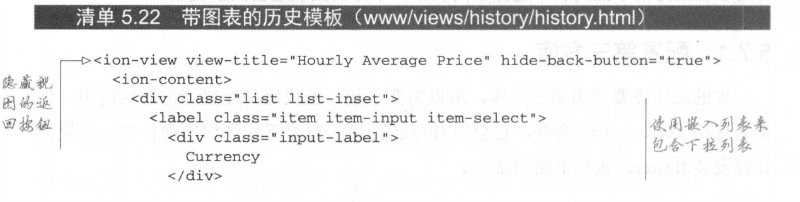

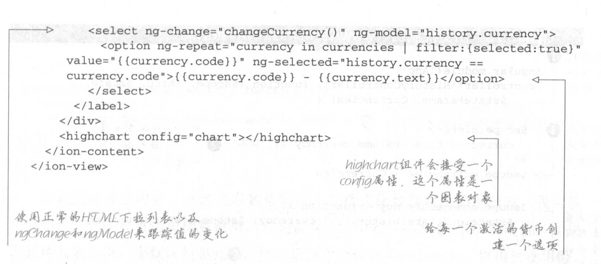

### 历史信息选项卡控制器：加载数据并配置图表

- 历史控制器

```js history/history.js
angular.module('App')
.controller('HistoryController', function ($scope, $http, $state, $stateParams, Currencies) {
// 1.创建控制器并注入服务
  $scope.history = {
    currency: $stateParams.currency || 'USD'
  }; // 2.给history模型赋值一个下拉列表，默认是美元
  $scope.currencies = Currencies; //3.把货币列表存储在作用域中

// 4.下面changeCurrency函数用来处理新货币被选择之后的状态变更
  $scope.changeCurrency = function () {
    $state.go('tabs.history', { currency: $scope.history.currency });
  };
 // 5.chart声明的对象会被Highcharts命令转换成图表
  $scope.chart = {
    options: {
      chart: {
        type: 'line'
      },
      legend: {
        enabled: false
      }
    },
    title: {
      text: null
    },
    yAxis: {
      title: null
    },
    xAxis: {
      type: 'datetime'
    },
    series: []
  };
// 6.基于被选中的货币加载历史信息
  $http.get('https://api.bitcoinaverage.com/history/' + $scope.history.currency + '/per_hour_monthly_sliding_window.csv').success(function (prices) {

    prices = prices.split(/\n/); // 7.把加个字符串分割成一个数组，每个元素都是一行价格
    var series = { // 8.创建一个空坐标系数组
      data: []
    };
    // 9.遍历每行价格
    angular.forEach(prices, function (price, index) {
      price = price.split(','); // 10.把每行用逗号分割成数组
      //11.解析并格式化时间和价格
      var date = new Date(price[0].replace(' ', 'T')).getTime();
      var value = parseFloat(price[3]);
      //12.如果日期和值合法，把这个点添加到坐标系数组中
      if (date && value > 0) {
        series.data.push([date, value]);
      }
    });

    $scope.chart.series.push(series);// 13.把完整的坐标系数组添加到图表的数据中
  });
  // 14.监听￥ionicView.enter事件，在没有缓存的情况下重置货币模型
  $scope.$on('$ionicView.beforeEnter', function() {
    $scope.history = {
      currency: $stateParams.currency || 'USD'
    };
  });
});
```

- history.js加入到idnex.html

- 更新历史选项卡的状态声明

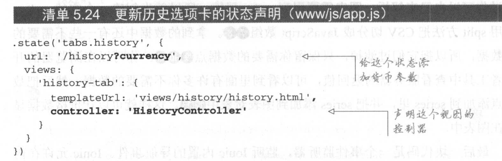

## 货币选项卡：支持重新排序和开关

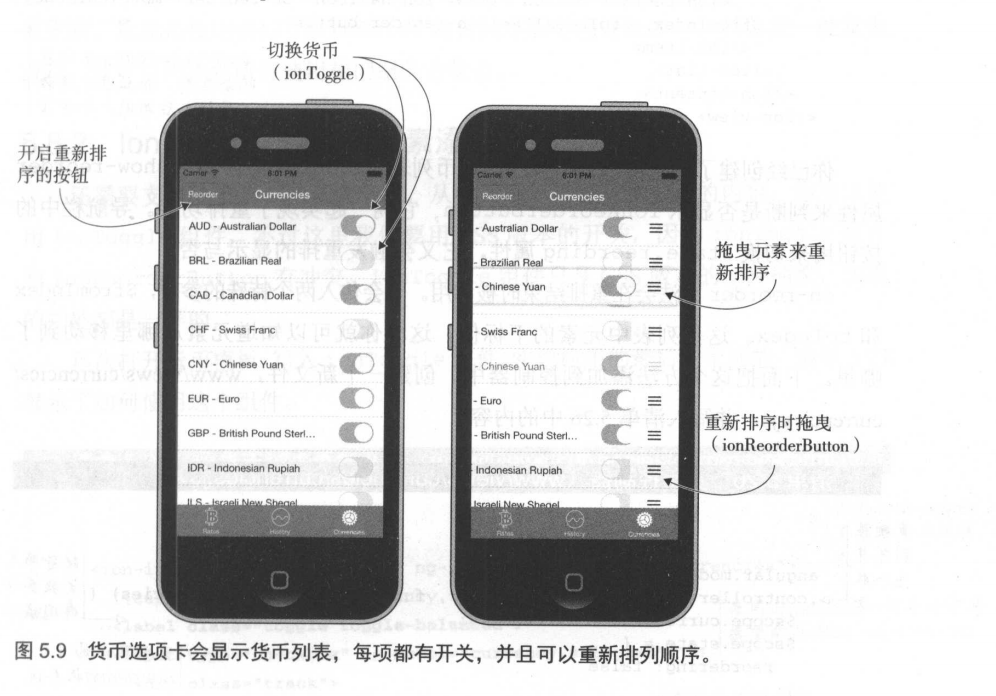

### lonReorderButton ：让列表支持重新排序

首先给货币选项卡添加一个模板，然后使用 `ionReorderButton` 来实现重新排序功能。重新排序只能用在 ionList 指令上。要使用它，可以设置 `reordering` 状态为 true 或者 false ，重新排序图标会根据这个值显示或者隐藏。 如果被激活，你可以使用图标拖动元素到新位置，然后你的控制器会自动更新模型。

- 更新货币模板

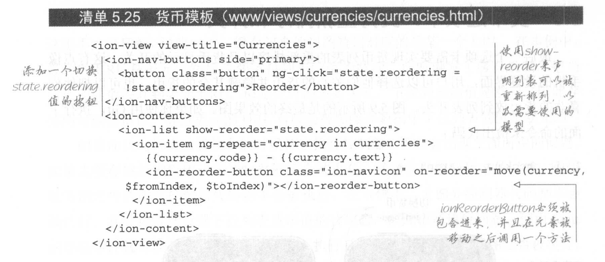

ionList 组件使用 show-reorder属性来判断是否显示 ionReorderButton ，它俩一起实现了重排功能 。导航栏中的按钮用来切换 state.reording 属性，它又会触发重排的显示与否。

- 货币控制器

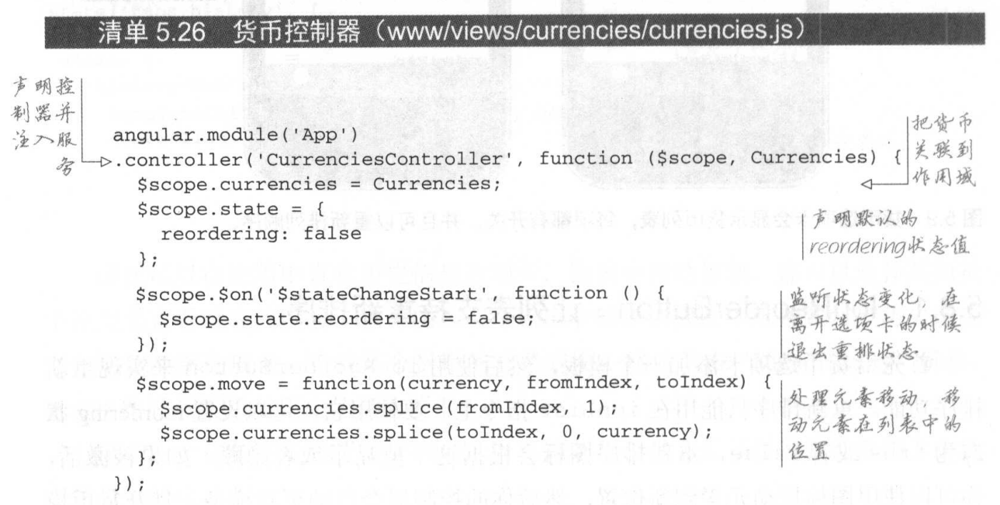

### lonToggle ：给列表元素添加开关

还需要支持设置货币的开关状态，从而让用户只看自己关心的内容。你可以使用 ionToggle 组件，不过这里我们要用 css 版本 的开关，因 为 ionToggle 组件和 ionReorderButton 有冲突 。 ionToggle 组件只是 css 版本的一种抽象 ， 实现的功能都是一样的 。

- 给列表添加开关

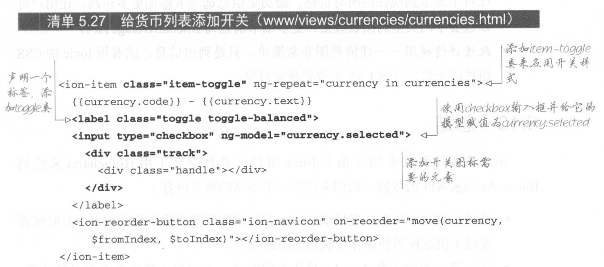

这个 ionToggle 组件使用复选框来记录开关值。复选框和开关都是布尔值 ，所以开关的 css 样式会覆盖 HTML 复选框 的默认样式。

## 挑战

- 自动刷新汇率：$interval服务
- 持久化货币设置：localStorage或者indexedDB;修改加载逻辑，在使用默认值之前先尝试从缓存中读取数据
- 绘制更多数据
- 改进详情视图